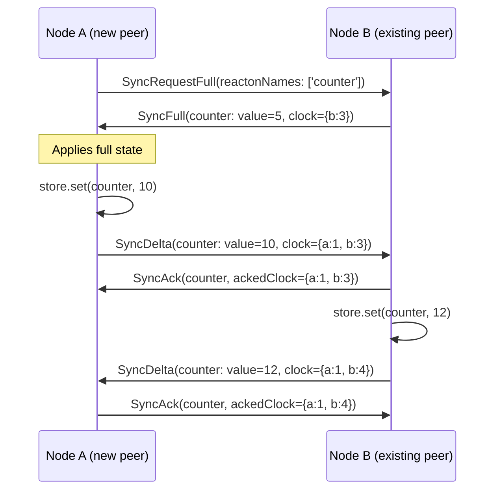
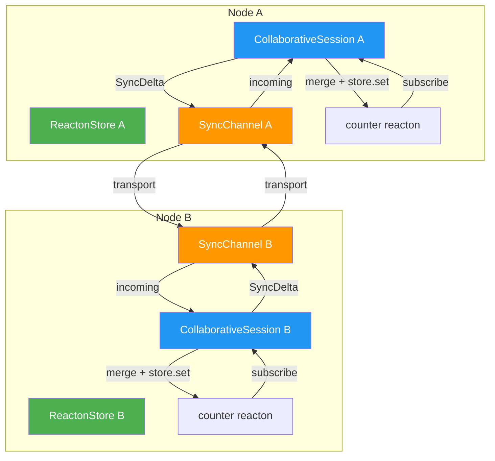

# Collaborative State (CRDT)

Collaborative state lets multiple distributed nodes -- different devices, browser tabs, or server instances -- share and modify the same reactive state concurrently without coordination. Reacton achieves this using **CRDTs** (Conflict-free Replicated Data Types): data structures that mathematically guarantee convergence. Every node that has received the same set of updates will arrive at the same state, regardless of the order in which those updates were applied.

This module provides vector clocks for causal ordering, pluggable merge strategies for conflict resolution, a JSON-based wire protocol, and a session manager that wires everything into the existing reactive graph.

## When to Use

- You are building a **real-time collaborative** feature (shared documents, multiplayer games, collaborative whiteboards).
- You need **offline-first** state that merges seamlessly when connectivity is restored.
- Multiple **browser tabs** or **isolates** need to share writable state without a central coordinator.
- You want **automatic conflict resolution** without manual diff/merge logic.

::: tip When NOT to Use
If only one node ever writes to the state (e.g., a server pushes read-only updates to clients), a simple WebSocket listener writing to a regular reacton is sufficient. CRDTs add overhead that is only justified when **multiple writers** can modify state concurrently.
:::

## Basic Usage

```dart
import 'package:reacton/reacton.dart';

// 1. Create a collaborative reacton
final counter = collaborativeReacton<int>(
  0,
  name: 'counter',
  strategy: MaxValue<int>(),  // highest value wins on conflict
);

// 2. Set up a sync channel (in-memory for demo; use WebSocket in production)
final (channelA, channelB) = InMemorySyncChannel.pair('node-a', 'node-b');

// 3. Create two stores simulating two nodes
final storeA = ReactonStore();
final storeB = ReactonStore();

// 4. Start collaborative sessions
final sessionA = storeA.collaborate(
  channel: channelA,
  reactons: [counter],
);

final sessionB = storeB.collaborate(
  channel: channelB,
  reactons: [counter],
);

// 5. Writes on one node propagate to the other
storeA.set(counter, 5);
// After sync: storeB.get(counter) == 5

// 6. Concurrent writes are resolved by the merge strategy
storeA.set(counter, 10);
storeB.set(counter, 7);
// After sync: both stores converge to 10 (MaxValue picks the larger)

// 7. Clean up
await sessionA.disconnect();
await sessionB.disconnect();
```

## API Reference

### `VectorClock` -- Causal Ordering

A vector clock tracks the latest known event counter for every node, enabling causal ordering of distributed events.

```dart
class VectorClock implements Comparable<VectorClock> {
  VectorClock(Map<String, int> entries);
  factory VectorClock.zero();
  factory VectorClock.fromJson(Map<String, dynamic> json);
}
```

| Method / Property | Return Type | Description |
|-------------------|-------------|-------------|
| `entries` | `Map<String, int>` | Unmodifiable map of node IDs to their counters |
| `operator [](nodeId)` | `int` | Counter for a node (0 if unknown) |
| `increment(nodeId)` | `VectorClock` | New clock with the given node's counter incremented by 1 |
| `merge(other)` | `VectorClock` | New clock with pointwise maximum of both clocks |
| `happensBefore(other)` | `bool` | `true` if this clock causally precedes `other` |
| `isConcurrent(other)` | `bool` | `true` if neither clock precedes the other (conflict) |
| `compareTo(other)` | `int` | -1 (before), 1 (after), 0 (equal or concurrent) |
| `sum` | `int` | Sum of all counters (rough "total events" metric) |
| `toJson()` | `Map<String, dynamic>` | JSON-serializable representation |

```dart
var clock = VectorClock.zero();
clock = clock.increment('node-a');  // {node-a: 1}
clock = clock.increment('node-a');  // {node-a: 2}

final other = VectorClock({'node-a': 1, 'node-b': 3});
final merged = clock.merge(other);  // {node-a: 2, node-b: 3}

clock.happensBefore(other); // false (node-a is ahead in clock)
clock.isConcurrent(other);  // true  (node-a ahead, node-b behind)
```

### `CrdtValue<T>` -- Value with Metadata

Wraps an application value with CRDT metadata for distributed conflict resolution.

```dart
class CrdtValue<T> {
  final T value;
  final VectorClock clock;
  final String nodeId;
  final int timestamp;  // milliseconds since epoch
}
```

| Field | Type | Description |
|-------|------|-------------|
| `value` | `T` | The application-level state |
| `clock` | `VectorClock` | Causal context at time of mutation |
| `nodeId` | `String` | The node that produced this mutation |
| `timestamp` | `int` | Wall-clock time for LWW tiebreaking |

| Method | Description |
|--------|-------------|
| `copyWith({...})` | Create a copy with optionally replaced fields |
| `toJson(serializeValue)` | Serialize to JSON-compatible map |
| `CrdtValue.fromJson(json, deserializeValue)` | Deserialize from JSON |

### Merge Strategies

Merge strategies are a sealed class hierarchy that determines how concurrent updates are resolved.

```dart
sealed class CrdtMergeStrategy<T> {
  T resolve(T localValue, T remoteValue,
    VectorClock localClock, VectorClock remoteClock,
    int localTimestamp, int remoteTimestamp);
}
```

| Strategy | Class | Behavior | Best For |
|----------|-------|----------|----------|
| **Last Writer Wins** | `LastWriterWins<T>` | Most recent wall-clock timestamp wins. Ties broken by lexicographic node ID. | General-purpose, most common default |
| **Max Value** | `MaxValue<T extends Comparable>` | Numerically larger value wins | Monotonic counters (GCounter) |
| **Union Merge** | `UnionMerge<T extends Set>` | Set union of both values (elements never removed) | Grow-only sets (GSet), tags, labels |
| **Custom Merge** | `CustomMerge<T>` | User-provided merge function | Domain-specific resolution |

```dart
// Last Writer Wins (default)
final counter = collaborativeReacton(0, name: 'counter');

// Max Value (GCounter pattern)
final visits = collaborativeReacton(0, name: 'visits', strategy: MaxValue<int>());

// Union Merge (GSet pattern)
final tags = collaborativeReacton<Set<String>>(
  {},
  name: 'tags',
  strategy: UnionMerge<Set<String>>(),
);

// Custom Merge
final doc = collaborativeReacton(
  Document.empty(),
  name: 'doc',
  strategy: CustomMerge<Document>((local, remote, lc, rc) {
    return Document.merge(local, remote);
  }),
);
```

::: warning CustomMerge Must Be Commutative
The merge function must satisfy `merge(a, b) == merge(b, a)` for all inputs. If the function is not commutative, different nodes may converge to different states, violating the CRDT guarantee.
:::

### `SyncMessage` -- Wire Protocol

A sealed hierarchy of JSON-serializable messages for state synchronization.

| Message | Type String | Purpose |
|---------|-------------|---------|
| `SyncFull` | `'sync_full'` | Complete state snapshot for a reacton |
| `SyncDelta` | `'sync_delta'` | Incremental update for a reacton |
| `SyncAck` | `'sync_ack'` | Acknowledgment of received update |
| `SyncRequestFull` | `'sync_request_full'` | Request for full state of specific reactons |

All messages support `toJson()`, `toJsonString()`, and static `fromJson()` / `fromJsonString()` factories.

```dart
// Serialize
final msg = SyncDelta(
  reactonName: 'counter',
  crdtValue: crdtValue,
  sourceNodeId: 'node-a',
);
final json = msg.toJsonString(); // JSON string for transport

// Deserialize
final parsed = SyncMessage.fromJsonString(
  json,
  deserializeValue: (name, raw) => raw, // or use a serializer
);
```

#### Protocol Flow



### `SyncChannel` -- Transport Abstraction

Abstract class for bidirectional message transport. Implement this to plug in any transport: WebSocket, HTTP, BLE, etc.

```dart
abstract class SyncChannel {
  String get localNodeId;        // Unique node identifier
  Stream<String> get incoming;   // Messages from remote peers
  void send(String message);     // Send to remote peers
  Future<void> close();          // Graceful shutdown
}
```

| Member | Type | Description |
|--------|------|-------------|
| `localNodeId` | `String` | Stable unique ID for this node (used as vector clock key) |
| `incoming` | `Stream<String>` | JSON-encoded messages from remote peers |
| `send(message)` | `void` | Transmit a JSON string to peers |
| `close()` | `Future<void>` | Gracefully close the transport |

### `InMemorySyncChannel` -- For Testing

Create a pair of connected in-memory channels. Messages sent on one appear on the other's `incoming` stream.

```dart
final (channelA, channelB) = InMemorySyncChannel.pair('node-a', 'node-b');
channelA.send('hello'); // channelB.incoming receives 'hello'
channelB.send('world'); // channelA.incoming receives 'world'
```

### `collaborativeReacton<T>()` -- Factory Function

```dart
CollaborativeReacton<T> collaborativeReacton<T>(
  T initialValue, {
  String? name,
  CrdtMergeStrategy<T>? strategy,
  Serializer<T>? serializer,
  ReactonOptions<T>? options,
})
```

| Parameter | Type | Default | Description |
|-----------|------|---------|-------------|
| `initialValue` | `T` | -- | Starting value before any sync |
| `name` | `String?` | auto-generated | Debug name and collaborative identifier |
| `strategy` | `CrdtMergeStrategy<T>?` | `LastWriterWins<T>()` | Conflict resolution strategy |
| `serializer` | `Serializer<T>?` | `null` | For wire transport (required for non-primitive types) |
| `options` | `ReactonOptions<T>?` | `null` | Standard reacton options |

### `CollaborativeSession` -- Managing Sync Lifecycle

Created via `store.collaborate()`. Manages the full sync lifecycle.

| Property / Method | Type | Description |
|-------------------|------|-------------|
| `onConflict` | `Stream<ConflictEvent<Object?>>` | Stream of detected and resolved conflicts |
| `syncStatus` | `Stream<SyncStatus>` | Stream of connection state changes |
| `currentStatus` | `SyncStatus` | Current synchronization status |
| `isConnected` | `bool` | Whether actively syncing |
| `peers` | `Set<String>` | Known peer node IDs |
| `localNodeId` | `String` | This node's identifier |
| `disconnect()` | `Future<void>` | Disconnect and release all resources |

### `SyncStatus` Enum

```dart
enum SyncStatus {
  disconnected,   // Not connected
  connecting,     // Establishing connection / full sync in progress
  connected,      // Fully connected and syncing
  reconnecting,   // Connection lost, attempting recovery
}
```

### `ConflictEvent<T>` -- Conflict Resolution Events

Emitted on `session.onConflict` whenever a concurrent update is resolved.

| Field | Type | Description |
|-------|------|-------------|
| `reactonName` | `String` | Which collaborative reacton had the conflict |
| `localValue` | `T` | The local value before merge |
| `remoteValue` | `T` | The remote value that conflicted |
| `resolvedValue` | `T` | The value chosen after resolution |
| `strategy` | `CrdtMergeStrategy<T>` | Which strategy was used |
| `localClock` | `VectorClock` | Local vector clock at conflict time |
| `remoteClock` | `VectorClock` | Remote vector clock at conflict time |

### Store Extensions

| Method | Signature | Description |
|--------|-----------|-------------|
| `collaborate()` | `CollaborativeSession collaborate({required SyncChannel channel, required List<CollaborativeReacton<Object?>> reactons, CrdtMergeStrategy<Object?>? defaultStrategy})` | Create and start a sync session |
| `isSynced()` | `bool isSynced(CollaborativeReacton<Object?> reacton)` | Whether the reacton is tracked by an active session |
| `clockOf()` | `VectorClock clockOf(CollaborativeReacton<Object?> reacton)` | Current vector clock for the reacton |
| `collaborativeSessions` | `List<CollaborativeSession>` | All active sessions on this store |

## How It Works



### Merge Algorithm

When a remote update arrives, the session follows this decision tree:

1. **Remote clock dominates local** (`local.happensBefore(remote)`): The remote state is strictly newer. Apply it directly -- no conflict.
2. **Local clock dominates remote** (`remote.happensBefore(local)`): The remote state is older. Ignore it -- we already have newer state.
3. **Clocks are concurrent** (`local.isConcurrent(remote)`): This is a true conflict. Invoke the configured `CrdtMergeStrategy.resolve()` to determine the winner. Emit a `ConflictEvent`. Merge the vector clocks (pointwise max) and increment the local counter.
4. **Clocks are equal**: State is already consistent. No action needed.

After resolution, the merged vector clock is stored alongside the resolved value, and the local reacton is updated via `store.set()`, triggering normal reactive graph propagation.

## Complete Example: Collaborative Counter with Two Nodes

```dart
import 'package:reacton/reacton.dart';

void main() async {
  // ── Define collaborative state ─────────────────────────────────
  final counter = collaborativeReacton<int>(
    0,
    name: 'sharedCounter',
    strategy: MaxValue<int>(), // always converge to the highest value
  );

  // ── Create transport ───────────────────────────────────────────
  final (channelA, channelB) = InMemorySyncChannel.pair('alice', 'bob');

  // ── Node A (Alice) ─────────────────────────────────────────────
  final storeA = ReactonStore();
  final sessionA = storeA.collaborate(
    channel: channelA,
    reactons: [counter],
  );

  sessionA.onConflict.listen((event) {
    print('[Alice] Conflict resolved: '
        '${event.localValue} vs ${event.remoteValue} -> ${event.resolvedValue}');
  });

  sessionA.syncStatus.listen((status) {
    print('[Alice] Sync status: $status');
  });

  // ── Node B (Bob) ───────────────────────────────────────────────
  final storeB = ReactonStore();
  final sessionB = storeB.collaborate(
    channel: channelB,
    reactons: [counter],
  );

  sessionB.onConflict.listen((event) {
    print('[Bob] Conflict resolved: '
        '${event.localValue} vs ${event.remoteValue} -> ${event.resolvedValue}');
  });

  // ── Simulate usage ─────────────────────────────────────────────

  // Alice increments to 5
  storeA.set(counter, 5);
  print('Alice: ${storeA.get(counter)}'); // 5

  // Bob sees the update
  print('Bob: ${storeB.get(counter)}');   // 5 (after sync)

  // Both increment concurrently
  storeA.set(counter, 10);
  storeB.set(counter, 7);
  // MaxValue resolves: both converge to 10

  // Check vector clocks
  print('Alice clock: ${storeA.clockOf(counter)}');
  print('Bob clock: ${storeB.clockOf(counter)}');
  print('Alice synced: ${storeA.isSynced(counter)}'); // true

  // ── Cleanup ────────────────────────────────────────────────────
  await sessionA.disconnect();
  await sessionB.disconnect();
  storeA.dispose();
  storeB.dispose();
}
```

## Implementing a WebSocket Channel

For production use, implement `SyncChannel` over your transport of choice:

```dart
class WebSocketSyncChannel extends SyncChannel {
  final WebSocketChannel _ws;
  final String _nodeId;

  WebSocketSyncChannel({
    required WebSocketChannel ws,
    required String nodeId,
  }) : _ws = ws, _nodeId = nodeId;

  @override
  String get localNodeId => _nodeId;

  @override
  Stream<String> get incoming => _ws.stream.cast<String>();

  @override
  void send(String message) => _ws.sink.add(message);

  @override
  Future<void> close() async => await _ws.sink.close();
}
```

## Common Mistakes

::: danger Non-Commutative Custom Merge
If your `CustomMerge` function is not commutative (`merge(a, b) != merge(b, a)`), different nodes will resolve conflicts differently and state will **never converge**. Always verify commutativity.

```dart
// BAD: not commutative -- always picks local
CustomMerge<int>((local, remote, lc, rc) => local);

// GOOD: commutative -- always picks the max
CustomMerge<int>((local, remote, lc, rc) => local > remote ? local : remote);
```
:::

::: warning Missing Serializer for Complex Types
If your collaborative reacton holds a non-primitive type (custom class, nested object), you **must** provide a `Serializer<T>`. Without it, the value cannot be transmitted over the wire.

```dart
// BAD: no serializer for custom type
final doc = collaborativeReacton(Document.empty(), name: 'doc');

// GOOD: serializer provided
final doc = collaborativeReacton(
  Document.empty(),
  name: 'doc',
  serializer: JsonSerializer<Document>(
    toJson: (d) => d.toMap(),
    fromJson: (j) => Document.fromMap(j),
  ),
);
```
:::

::: warning Unique Collaborative Names
Each `CollaborativeReacton` in a session must have a unique `name`. If two reactons share the same name, remote updates will be routed to the wrong state.

```dart
// BAD: both use the same name
final a = collaborativeReacton(0, name: 'counter');
final b = collaborativeReacton('', name: 'counter'); // name collision!

// GOOD: unique names
final a = collaborativeReacton(0, name: 'visitCount');
final b = collaborativeReacton('', name: 'welcomeMessage');
```
:::

::: tip Monitor Conflicts in Production
Always listen to `session.onConflict` in production to log conflicts for observability. Even with automatic resolution, knowing when conflicts occur helps you tune your merge strategy and understand user behavior.
:::

## What's Next

- [Multi-Isolate](/advanced/isolates) -- Share state across Dart isolates
- [Snapshots & Diffs](/advanced/snapshots) -- Capture and compare state at points in time
- [Persistence](/advanced/persistence) -- Persist collaborative state to disk for offline support
- [Sagas](/advanced/sagas) -- Orchestrate complex async workflows alongside collaborative state
