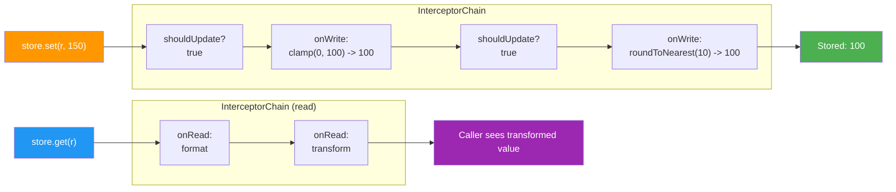

# Interceptors

Interceptors are **lightweight value transformers** that sit between the outside world and a reacton's stored value. They can transform values on write, transform values on read, and conditionally gate updates -- all without the ceremony of a full `Middleware<T>` subclass. If middleware is a Swiss army knife, an interceptor is a scalpel: small, focused, and fast.

An interceptor does not see the full reacton lifecycle (no `onInit`, `onDispose`, or `onError` hooks). It only cares about three things: what value is being written, what value is being read, and whether a particular update should be allowed at all.

## When to Use

- You need to **clamp**, **normalize**, or **sanitize** values before they are stored (e.g., enforce a range, trim strings, round floats).
- You want to **gate updates** -- reject writes that violate a business rule without throwing an exception.
- You need to **transform reads** -- present a derived view of the stored value without creating a separate computed reacton.
- You want something **simpler than middleware** for value-level concerns.

::: tip Interceptors vs Middleware
Use **interceptors** when you only need value transformation or gating. Use **middleware** when you need lifecycle hooks (`onInit`, `onDispose`, `onError`, `onAfterWrite`) or cross-cutting concerns like logging, analytics, or persistence. Both can coexist on the same reacton.
:::

## Basic Usage

```dart
import 'package:reacton/reacton.dart';

// Clamp an integer between 0 and 100
final clampInterceptor = Interceptor<int>(
  name: 'clamp_0_100',
  onWrite: (value) => value.clamp(0, 100),
);

// Use with an InterceptorChain
final chain = InterceptorChain<int>([clampInterceptor]);

// On write: value is clamped
final (accepted, result) = chain.executeWrite(50, 150);
// accepted: true, result: 100

// On read: pass-through (no onRead defined)
final readValue = chain.executeRead(42);
// readValue: 42
```

## API Reference

### `Interceptor<T>`

A single interceptor with optional write transform, read transform, and update gate.

```dart
class Interceptor<T> {
  final String name;
  final T Function(T value)? onWrite;
  final T Function(T value)? onRead;
  final bool Function(T oldValue, T newValue)? shouldUpdate;

  const Interceptor({
    required this.name,
    this.onWrite,
    this.onRead,
    this.shouldUpdate,
  });
}
```

| Parameter | Type | Default | Description |
|-----------|------|---------|-------------|
| `name` | `String` | **required** | Debug name for logging and identification |
| `onWrite` | `T Function(T)?` | `null` | Transforms the value **before** it is stored. Receives the new value, returns the (possibly modified) value to store. |
| `onRead` | `T Function(T)?` | `null` | Transforms the value **when read**. Receives the stored value, returns the value the caller sees. |
| `shouldUpdate` | `bool Function(T old, T new)?` | `null` | Returns `false` to **reject** the update entirely. The old value is preserved and no downstream propagation occurs. |

### `InterceptorChain<T>`

Executes a list of interceptors in order.

```dart
class InterceptorChain<T> {
  const InterceptorChain(List<Interceptor<T>> interceptors);
  (bool accepted, T value) executeWrite(T currentValue, T newValue);
  T executeRead(T value);
}
```

| Method | Signature | Description |
|--------|-----------|-------------|
| `executeWrite` | `(bool accepted, T value) executeWrite(T currentValue, T newValue)` | Run all interceptors' `shouldUpdate` and `onWrite` hooks. Returns a record: `accepted` is `false` if any interceptor rejected the update; `value` is the final transformed value (or the original `currentValue` if rejected). |
| `executeRead` | `T executeRead(T value)` | Run all interceptors' `onRead` hooks in sequence. Returns the final transformed value. |

#### Write Execution Order

For each interceptor in the chain (in order):

1. If `shouldUpdate` is defined, call it with `(currentValue, candidateValue)`. If it returns `false`, **stop immediately** and return `(false, currentValue)`.
2. If `onWrite` is defined, call it with the candidate value and replace the candidate with the result.
3. Move to the next interceptor.

If all interceptors pass, return `(true, finalValue)`.

#### Read Execution Order

For each interceptor in the chain (in order):

1. If `onRead` is defined, call it with the current value and replace it with the result.
2. Move to the next interceptor.

Return the final value.

## How It Works



## Examples

### Value Clamping

Ensure a numeric value stays within bounds:

```dart
final volumeInterceptor = Interceptor<double>(
  name: 'volume_clamp',
  onWrite: (value) => value.clamp(0.0, 1.0),
);

final chain = InterceptorChain<double>([volumeInterceptor]);

chain.executeWrite(0.5, 1.5);  // (true, 1.0)
chain.executeWrite(0.5, -0.3); // (true, 0.0)
chain.executeWrite(0.5, 0.7);  // (true, 0.7)
```

### String Normalization

Trim whitespace and normalize casing:

```dart
final normalizeInterceptor = Interceptor<String>(
  name: 'normalize',
  onWrite: (value) => value.trim().toLowerCase(),
);

final chain = InterceptorChain<String>([normalizeInterceptor]);

chain.executeWrite('', '  Hello World  '); // (true, 'hello world')
```

### Conditional Gating

Reject updates that violate a business rule:

```dart
final nonNegativeGate = Interceptor<int>(
  name: 'non_negative',
  shouldUpdate: (oldValue, newValue) => newValue >= 0,
);

final chain = InterceptorChain<int>([nonNegativeGate]);

chain.executeWrite(5, 10);  // (true, 10)  -- accepted
chain.executeWrite(5, -1);  // (false, 5)  -- rejected, old value preserved
```

### Read Transformation

Present a different view of the stored value without modifying it:

```dart
final censorInterceptor = Interceptor<String>(
  name: 'censor_email',
  onRead: (value) {
    // Hide the middle of an email address
    final parts = value.split('@');
    if (parts.length == 2) {
      final name = parts[0];
      final masked = '${name[0]}${'*' * (name.length - 1)}';
      return '$masked@${parts[1]}';
    }
    return value;
  },
);

final chain = InterceptorChain<String>([censorInterceptor]);

// Stored: 'alice@example.com'
chain.executeRead('alice@example.com'); // 'a****@example.com'
```

### Combining Multiple Interceptors

Chain interceptors for layered logic. They execute in order:

```dart
final trimInterceptor = Interceptor<String>(
  name: 'trim',
  onWrite: (value) => value.trim(),
);

final maxLengthInterceptor = Interceptor<String>(
  name: 'max_length_50',
  onWrite: (value) => value.length > 50 ? value.substring(0, 50) : value,
);

final nonEmptyGate = Interceptor<String>(
  name: 'non_empty',
  shouldUpdate: (old, value) => value.isNotEmpty,
);

final chain = InterceptorChain<String>([
  trimInterceptor,        // 1. Trim whitespace
  nonEmptyGate,           // 2. Reject if empty after trim
  maxLengthInterceptor,   // 3. Truncate to 50 chars
]);

chain.executeWrite('', '  Hello  ');      // (true, 'Hello')
chain.executeWrite('old', '   ');          // (false, 'old') -- empty after trim
chain.executeWrite('', 'A' * 100);         // (true, 'AAAA...A') -- 50 chars
```

## Interceptors vs Middleware Decision Guide

| Concern | Interceptor | Middleware |
|---------|-------------|-----------|
| **Value clamping / normalization** | Preferred | Works, but overkill |
| **Conditional update gating** | Preferred (`shouldUpdate`) | Works (`onBeforeWrite` + throw) |
| **Read-time transformation** | Supported (`onRead`) | Not available |
| **Initialization hook** | Not available | `onInit` |
| **Post-write side effects** | Not available | `onAfterWrite` |
| **Disposal cleanup** | Not available | `onDispose` |
| **Error handling** | Not available | `onError` |
| **Logging / analytics** | Possible but limited | Preferred (full lifecycle) |
| **Persistence** | Not available | Preferred (lifecycle hooks) |
| **Complexity** | 3 optional callbacks | Full class with 5 lifecycle hooks |
| **Performance** | Minimal overhead | Slightly more overhead |

**Rule of thumb:** Start with interceptors. Graduate to middleware when you need lifecycle hooks or cross-cutting side effects.

## Complete Example: Validated Temperature Input

```dart
import 'package:reacton/reacton.dart';

// ── Interceptors ──────────────────────────────────────────────────

// Clamp temperature to physically reasonable range
final tempClamp = Interceptor<double>(
  name: 'temp_clamp',
  onWrite: (value) => value.clamp(-273.15, 1000.0), // absolute zero to 1000C
);

// Round to 1 decimal place on write
final tempRound = Interceptor<double>(
  name: 'temp_round',
  onWrite: (value) => (value * 10).roundToDouble() / 10,
);

// Reject NaN and infinity
final tempSanitize = Interceptor<double>(
  name: 'temp_sanitize',
  shouldUpdate: (old, value) => value.isFinite,
);

// Display in Fahrenheit on read (stored as Celsius internally)
final celsiusToFahrenheit = Interceptor<double>(
  name: 'celsius_to_fahrenheit',
  onRead: (celsius) => celsius * 9 / 5 + 32,
);

// ── Chain ─────────────────────────────────────────────────────────
final tempChain = InterceptorChain<double>([
  tempSanitize,         // 1. Reject NaN/infinity
  tempClamp,            // 2. Clamp to valid range
  tempRound,            // 3. Round to 1 decimal
]);

final displayChain = InterceptorChain<double>([
  celsiusToFahrenheit,  // Convert for display
]);

// ── Usage ─────────────────────────────────────────────────────────
void main() {
  // Write path
  var (accepted, value) = tempChain.executeWrite(20.0, 25.678);
  print('Write 25.678 -> accepted: $accepted, stored: $value');
  // accepted: true, stored: 25.7

  (accepted, value) = tempChain.executeWrite(20.0, double.nan);
  print('Write NaN -> accepted: $accepted, stored: $value');
  // accepted: false, stored: 20.0

  (accepted, value) = tempChain.executeWrite(20.0, -500.0);
  print('Write -500.0 -> accepted: $accepted, stored: $value');
  // accepted: true, stored: -273.2 (clamped to absolute zero)

  // Read path
  final displayed = displayChain.executeRead(25.7);
  print('Stored 25.7C -> displayed: ${displayed}F');
  // Stored 25.7C -> displayed: 78.26F
}
```

## Common Mistakes

::: danger Interceptor Order Matters
Interceptors execute in the order they appear in the list. A `shouldUpdate` gate that checks a minimum length should come **after** a trimming interceptor, not before.

```dart
// BAD: gate runs before trim, so '   ' (3 chars) passes the length check
final chain = InterceptorChain<String>([
  Interceptor(name: 'min3', shouldUpdate: (_, v) => v.length >= 3),
  Interceptor(name: 'trim', onWrite: (v) => v.trim()),
]);
chain.executeWrite('', '   '); // (true, '') -- oops, stored empty string

// GOOD: trim first, then gate
final chain = InterceptorChain<String>([
  Interceptor(name: 'trim', onWrite: (v) => v.trim()),
  Interceptor(name: 'min3', shouldUpdate: (_, v) => v.length >= 3),
]);
chain.executeWrite('', '   '); // (false, '') -- rejected
```
:::

::: warning onRead Does Not Modify Stored Value
`onRead` transforms the value **only for the caller**. The stored value in the reacton is unchanged. Do not use `onRead` if you expect the transformation to persist.

```dart
final chain = InterceptorChain<int>([
  Interceptor(name: 'double_on_read', onRead: (v) => v * 2),
]);

// Stored value is 5
chain.executeRead(5);  // Returns 10 to the caller
// But the store still holds 5
```
:::

::: tip Keep Interceptors Pure
Interceptors should be **pure functions** -- no side effects, no async, no external state. If you need side effects (logging, analytics, persistence), use middleware instead.
:::

## What's Next

- [Middleware](/advanced/middleware) -- Full lifecycle hooks for cross-cutting concerns
- [Lenses](/advanced/lenses) -- Bidirectional optics for deep state updates
- [Core Concepts](/guide/core-concepts) -- Reactons, computed values, and the reactive graph
- [Snapshots & Diffs](/advanced/snapshots) -- Capture and compare store state
