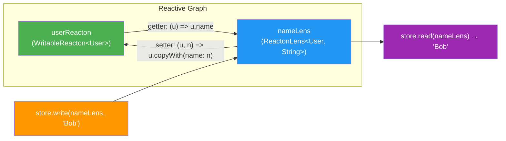

# Lenses

Lenses are **bidirectional optics** that let you focus on a nested part of a reacton's state, read from it, and write back to it -- all while keeping the reactive graph in sync. They eliminate the boilerplate of deep state updates and make it trivial to work with complex, nested data structures in a type-safe, composable way.

Think of a lens as a magnifying glass placed over a single field inside a larger object. You can inspect the field and replace it, and the change propagates back through every layer of nesting automatically.

## When to Use

- You have **deeply nested state** (e.g., `user.address.city`) and want to read/write a single leaf without manually reconstructing every parent.
- You want to give a widget a **scoped, writable view** into part of a larger model.
- You need to **compose** multiple focus operations (address lens + city lens) into a single lens.
- You want to focus on a **specific list item by index**, a **map entry by key**, or a **filtered subset** of a list.

::: tip When NOT to Use
If your state is flat (e.g., a single `int` or `String`), lenses add unnecessary indirection. Use `store.set()` directly. Similarly, if you only need to _read_ a sub-value without writing it back, a `selector()` is simpler and lighter.
:::

## Basic Usage

```dart
import 'package:reacton/reacton.dart';

// 1. Define your model
class User {
  final String name;
  final Address address;
  User({required this.name, required this.address});
  User copyWith({String? name, Address? address}) =>
      User(name: name ?? this.name, address: address ?? this.address);
}

class Address {
  final String city;
  final String zip;
  Address({required this.city, required this.zip});
  Address copyWith({String? city, String? zip}) =>
      Address(city: city ?? this.city, zip: zip ?? this.zip);
}

// 2. Create a writable reacton
final userReacton = reacton(
  User(name: 'Alice', address: Address(city: 'NYC', zip: '10001')),
  name: 'user',
);

// 3. Create a lens that focuses on the user's name
final nameLens = lens(
  userReacton,
  (user) => user.name,                         // getter
  (user, name) => user.copyWith(name: name),    // setter
  name: 'user.name',
);

// 4. Read and write through the lens
final store = ReactonStore();
store.read(nameLens);             // 'Alice'
store.write(nameLens, 'Bob');     // user reacton is now User(name: 'Bob', ...)
store.read(nameLens);             // 'Bob'
```

## API Reference

### `lens<S, T>()` -- Top-Level Factory

Creates a `ReactonLens<S, T>` focusing on a part of a writable reacton's state.

```dart
ReactonLens<S, T> lens<S, T>(
  WritableReacton<S> source,
  T Function(S) get,
  S Function(S, T) set, {
  String? name,
  bool Function(T, T)? equals,
})
```

| Parameter | Type | Description |
|-----------|------|-------------|
| `source` | `WritableReacton<S>` | The reacton to focus into |
| `get` | `T Function(S)` | Extracts the focused value from the source |
| `set` | `S Function(S, T)` | Produces a new source given the current source and a new focused value |
| `name` | `String?` | Debug name for DevTools and logging |
| `equals` | `bool Function(T, T)?` | Custom equality for the focused value (uses `==` by default) |

### `listLens<T>()` -- Focus on a List Item

Creates a `ListItemLens<T>` that focuses on a single element by index.

```dart
ListItemLens<T> listLens<T>(
  WritableReacton<List<T>> source,
  int index, {
  String? name,
})
```

| Parameter | Type | Description |
|-----------|------|-------------|
| `source` | `WritableReacton<List<T>>` | The list reacton |
| `index` | `int` | Zero-based index of the element to focus on |
| `name` | `String?` | Debug name |

**Behavior:**
- **Read**: Returns `source[index]`.
- **Write**: Produces a new list with `source[index]` replaced.
- Throws `RangeError` if `index` is out of bounds at read or write time.

```dart
final todosReacton = reacton<List<String>>(['Buy milk', 'Walk dog', 'Read book']);
final secondTodo = listLens(todosReacton, 1);

store.read(secondTodo);              // 'Walk dog'
store.write(secondTodo, 'Walk cat'); // list is now ['Buy milk', 'Walk cat', 'Read book']
```

### `mapLens<K, V>()` -- Focus on a Map Entry

Creates a `MapEntryLens<K, V>` that focuses on a single key in a map.

```dart
MapEntryLens<K, V> mapLens<K, V>(
  WritableReacton<Map<K, V>> source,
  K key, {
  String? name,
})
```

| Parameter | Type | Description |
|-----------|------|-------------|
| `source` | `WritableReacton<Map<K, V>>` | The map reacton |
| `key` | `K` | The key to focus on |
| `name` | `String?` | Debug name |

**Behavior:**
- **Read**: Returns `source[key]` (nullable -- returns `null` if absent).
- **Write**: Produces a new map with `key` set to the value. Writing `null` removes the key.

```dart
final settingsReacton = reacton<Map<String, String>>({'theme': 'dark', 'lang': 'en'});
final themeLens = mapLens(settingsReacton, 'theme');

store.read(themeLens);           // 'dark'
store.write(themeLens, 'light'); // settings becomes {'theme': 'light', 'lang': 'en'}
store.write(themeLens, null);    // removes 'theme' key
```

### `filteredListLens<T>()` -- Focus on a Filtered Subset

Creates a `FilteredListLens<T>` that focuses on elements matching a predicate.

```dart
FilteredListLens<T> filteredListLens<T>(
  WritableReacton<List<T>> source,
  bool Function(T) predicate, {
  String? name,
  bool Function(List<T>, List<T>)? equals,
})
```

| Parameter | Type | Description |
|-----------|------|-------------|
| `source` | `WritableReacton<List<T>>` | The list reacton |
| `predicate` | `bool Function(T)` | Selects which elements to include |
| `name` | `String?` | Debug name |
| `equals` | `bool Function(List<T>, List<T>)?` | Custom list equality (defaults to shallow element comparison) |

**Behavior:**
- **Read**: Returns a new list of elements matching the predicate, preserving order.
- **Write**: Merges updated elements back. Matching elements are replaced in order. If the written list is shorter, excess matches are removed. If longer, extra elements are appended.

```dart
final numbers = reacton<List<int>>([1, 2, 3, 4, 5]);
final evens = filteredListLens(numbers, (n) => n.isEven);

store.read(evens);              // [2, 4]
store.write(evens, [20, 40]);   // numbers becomes [1, 20, 3, 40, 5]
```

### `ComposedLens<A, B, C>` -- Chaining with `.then()`

Compose two lenses in sequence. Given an outer lens `A -> B` and an inner focus `B -> C`, the result is a lens `A -> C`.

```dart
ComposedLens<S, T, C> then<C>({
  required C Function(T) get,
  required T Function(T, C) set,
  String? name,
  bool Function(C, C)? equals,
})
```

| Parameter | Type | Description |
|-----------|------|-------------|
| `get` | `C Function(T)` | Extracts the inner focused value |
| `set` | `T Function(T, C)` | Produces a new intermediate value given the current and the new inner value |
| `name` | `String?` | Debug name for the composed lens |
| `equals` | `bool Function(C, C)?` | Custom equality for the innermost focused value |

Composition can be chained to arbitrary depth, and every step is fully type-safe.

### Composition Convenience Methods

`ReactonLens` provides shorthand methods for common composition patterns:

| Method | Signature | Description |
|--------|-----------|-------------|
| `.item<E>(index)` | `ComposedLens<S, List<E>, E>` | Compose to focus on a list element at `index` |
| `.entry<K, V>(key)` | `ComposedLens<S, Map<K, V>, V?>` | Compose to focus on a map entry at `key` |

```dart
final itemsLens = lens(state, (s) => s.items, (s, i) => s.copyWith(items: i));
final firstItem = itemsLens.item<Todo>(0);

final metaLens = lens(state, (s) => s.metadata, (s, m) => s.copyWith(metadata: m));
final versionLens = metaLens.entry<String, int>('version');
```

### Store Extensions

The `ReactonStoreLens` extension provides lens-aware operations on `ReactonStore`:

| Method | Signature | Description |
|--------|-----------|-------------|
| `read` | `T read<S, T>(ReactonLens<S, T> lens)` | Read the focused value (initializes the lens if needed) |
| `write` | `void write<S, T>(ReactonLens<S, T> lens, T value)` | Write a new focused value back through the setter |
| `modify` | `void modify<S, T>(ReactonLens<S, T> lens, T Function(T) updater)` | Read, apply a function, and write back |
| `subscribeLens` | `Unsubscribe subscribeLens<S, T>(ReactonLens<S, T> lens, void Function(T) listener)` | Subscribe to focused value changes |
| `removeLens` | `void removeLens<S, T>(ReactonLens<S, T> lens)` | Remove a lens and clean up its source subscription |

Additional convenience aliases via `ReactonStoreLensIntegration`:

| Method | Equivalent To |
|--------|---------------|
| `getLens(lens)` | `read(lens)` |
| `setLens(lens, value)` | `write(lens, value)` |

## How It Works



### Write Propagation

When you call `store.write(lens, value)`:

1. The store reads the **current source value** from the store.
2. The lens **setter** is called with the current source and the new focused value, producing a new source.
3. The new source is written to the **source reacton** via `store.set(source, newSource)`.
4. The reactive graph propagates the change. All subscribers of the source -- including the lens itself -- are notified.
5. The lens subscription computes the new focused value via the **getter** and updates its own slot, notifying lens subscribers.

### Initialization

A lens must be initialized in a store before it can read or write. The store extension handles this automatically on first access via `read()`, `write()`, `modify()`, or `subscribeLens()`. Initialization:

1. Computes the initial focused value from the live source.
2. Stores it in the lens slot via `forceSet`.
3. Populates the internal `_SourceReader` so `onWrite` can read the current source.
4. Subscribes to the source so that source mutations automatically refresh the lens (with equality gating).

After initialization, the standard `store.get(lens)` and `store.set(lens, value)` work transparently -- as do Flutter's `context.watch(lens)` and `context.set(lens, value)`.

## Complete Example: Nested User Profile Editor

```dart
import 'package:reacton/reacton.dart';

// ── Models ─────────────────────────────────────────────────────────
class UserProfile {
  final String name;
  final Address address;
  final Settings settings;

  UserProfile({required this.name, required this.address, required this.settings});
  UserProfile copyWith({String? name, Address? address, Settings? settings}) =>
      UserProfile(
        name: name ?? this.name,
        address: address ?? this.address,
        settings: settings ?? this.settings,
      );
}

class Address {
  final String street;
  final String city;
  final String zip;

  Address({required this.street, required this.city, required this.zip});
  Address copyWith({String? street, String? city, String? zip}) =>
      Address(
        street: street ?? this.street,
        city: city ?? this.city,
        zip: zip ?? this.zip,
      );
}

class Settings {
  final String theme;
  final bool notifications;

  Settings({required this.theme, required this.notifications});
  Settings copyWith({String? theme, bool? notifications}) =>
      Settings(
        theme: theme ?? this.theme,
        notifications: notifications ?? this.notifications,
      );
}

// ── Reacton & Lenses ──────────────────────────────────────────────
final profileReacton = reacton(
  UserProfile(
    name: 'Alice',
    address: Address(street: '123 Main St', city: 'NYC', zip: '10001'),
    settings: Settings(theme: 'dark', notifications: true),
  ),
  name: 'profile',
);

// First level: focus on address and settings
final addressLens = lens(
  profileReacton,
  (p) => p.address,
  (p, a) => p.copyWith(address: a),
  name: 'profile.address',
);

final settingsLens = lens(
  profileReacton,
  (p) => p.settings,
  (p, s) => p.copyWith(settings: s),
  name: 'profile.settings',
);

// Second level: compose to reach leaves
final cityLens = addressLens.then(
  get: (a) => a.city,
  set: (a, c) => a.copyWith(city: c),
  name: 'profile.address.city',
);

final zipLens = addressLens.then(
  get: (a) => a.zip,
  set: (a, z) => a.copyWith(zip: z),
  name: 'profile.address.zip',
);

final themeLens = settingsLens.then(
  get: (s) => s.theme,
  set: (s, t) => s.copyWith(theme: t),
  name: 'profile.settings.theme',
);

final notificationsLens = settingsLens.then(
  get: (s) => s.notifications,
  set: (s, n) => s.copyWith(notifications: n),
  name: 'profile.settings.notifications',
);

// ── Usage ─────────────────────────────────────────────────────────
void main() {
  final store = ReactonStore();

  // Read deeply nested values
  print(store.read(cityLens));           // 'NYC'
  print(store.read(themeLens));          // 'dark'

  // Write deeply nested values -- parent objects are reconstructed automatically
  store.write(cityLens, 'San Francisco');
  store.write(themeLens, 'light');

  // The root profile reacton reflects all changes
  final profile = store.get(profileReacton);
  print(profile.address.city);           // 'San Francisco'
  print(profile.settings.theme);         // 'light'

  // modify() for functional updates
  store.modify(zipLens, (z) => '${z}-1234');
  print(store.read(zipLens));            // '10001-1234'

  // Subscribe to focused changes
  final unsub = store.subscribeLens(notificationsLens, (enabled) {
    print('Notifications: $enabled');
  });

  store.write(notificationsLens, false); // prints: Notifications: false

  unsub();

  // Clean up
  store.dispose();
}
```

## Lenses vs Direct State Updates

| Concern | Direct `store.set()` | Lens |
|---------|---------------------|------|
| **Flat state** (`int`, `String`) | Preferred -- simple and direct | Unnecessary overhead |
| **One level of nesting** | Fine with `copyWith` | Optional convenience |
| **Deep nesting** (3+ levels) | Verbose `copyWith` chains | Eliminates boilerplate |
| **Reusable sub-views** | Must rebuild manually | Compose once, reuse everywhere |
| **Widget-level scoping** | Widget sees entire model | Widget receives only what it needs |
| **Read-only sub-value** | Use `selector()` instead | Use `selector()` -- lenses are for read + write |

## Common Mistakes

::: danger Out-of-Bounds List Lens
`listLens` throws `RangeError` at runtime if the index is out of bounds. Always ensure the index is valid before creating the lens, or handle the error.

```dart
// BAD: index might become invalid if the list shrinks
final itemLens = listLens(todosReacton, 5); // throws if list has < 6 items

// GOOD: validate before access
if (store.get(todosReacton).length > index) {
  final itemLens = listLens(todosReacton, index);
  store.read(itemLens);
}
```
:::

::: warning Lens Identity
Like all reactons, each call to `lens()`, `listLens()`, `mapLens()`, or `filteredListLens()` creates a new identity. Declare lenses as **top-level variables** or **static fields** -- never inside `build()`.

```dart
// BAD: new identity every frame
Widget build(BuildContext context) {
  final cityLens = lens(userReacton, (u) => u.city, ...); // new ref each build!
  return Text(context.watch(cityLens));
}

// GOOD: declared once, reused everywhere
final cityLens = lens(userReacton, (u) => u.city, ...);

Widget build(BuildContext context) {
  return Text(context.watch(cityLens));
}
```
:::

::: tip Equality Gating
By default, lens subscribers are only notified when the focused value changes (using `==`). If your focused type does not implement `==` correctly (e.g., mutable objects, custom classes without `operator ==`), provide a custom `equals` function to avoid unnecessary rebuilds or missed updates.

```dart
final addressLens = lens(
  userReacton,
  (u) => u.address,
  (u, a) => u.copyWith(address: a),
  equals: (a, b) => a.city == b.city && a.zip == b.zip,
);
```
:::

## What's Next

- [Interceptors](/advanced/interceptors) -- Transform or gate lens values with lightweight interceptors
- [Snapshots & Diffs](/advanced/snapshots) -- Capture store state including lens values
- [Core Concepts](/guide/core-concepts) -- Reactons, computed values, selectors, and the reactive graph
- [Context Extensions](/flutter/context-extensions) -- Using `context.watch()` and `context.set()` with lenses in Flutter
