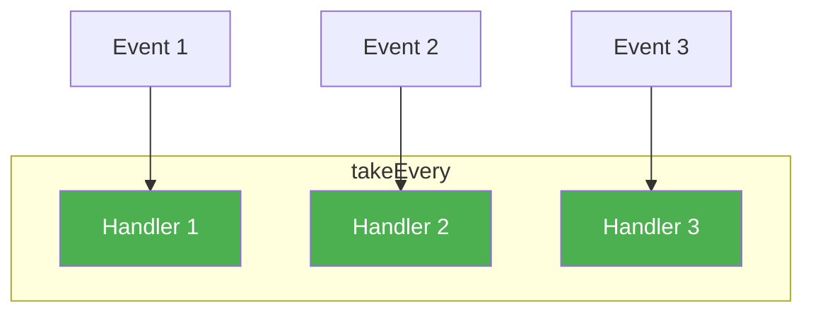
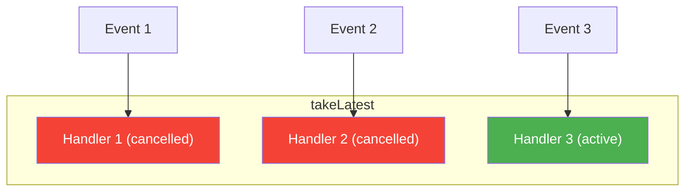
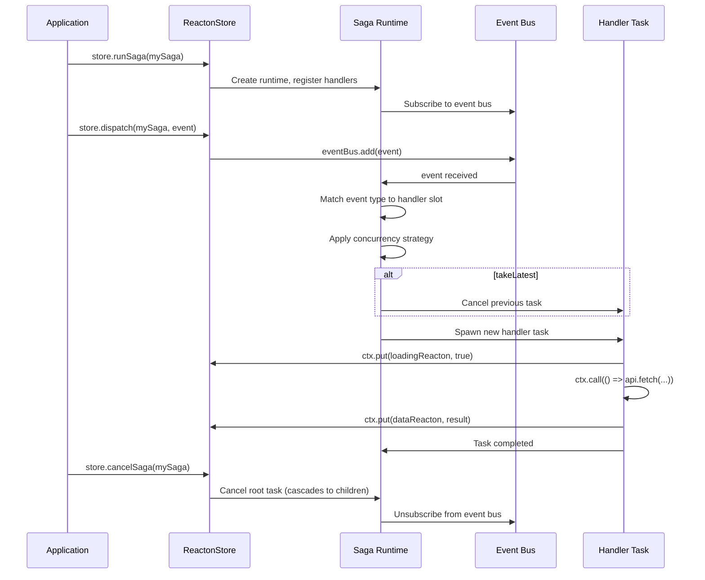

# Sagas

Sagas are **long-running, cancellable async workflows** that orchestrate complex side effects in response to dispatched events. Inspired by Redux-Saga, Reacton's saga system gives you declarative control over concurrency, sequencing, forking, racing, and cancellation -- all while reading and writing reactive state through the store.

If middleware is a gatekeeper that inspects every write, a saga is a director that choreographs multi-step processes: login flows, checkout sequences, polling loops, WebSocket listeners, and any workflow where steps depend on external events or timers.

## When to Use

- You have **multi-step async workflows** (e.g., login -> fetch profile -> redirect).
- You need **concurrency control**: only one request at a time (takeLeading), cancel stale requests (takeLatest), or handle every event independently (takeEvery).
- You need to **fork** parallel tasks, **race** competing futures, or **join** on child tasks.
- You want **cancellation** that cascades from parent to child automatically.
- You need to **coordinate multiple store writes** across async boundaries.

::: tip When NOT to Use
For simple one-shot async operations (fetch data, update state), use an `asyncReacton` or a plain effect. Sagas shine when the workflow has multiple steps, branching logic, or concurrency requirements.
:::

## Basic Usage

```dart
import 'package:reacton/reacton.dart';

// 1. Define your events
class FetchUserRequested {
  final int userId;
  FetchUserRequested(this.userId);
}

class FetchUserSucceeded {
  final User user;
  FetchUserSucceeded(this.user);
}

// 2. Define your state reactons
final userReacton = reacton<User?>(null, name: 'user');
final loadingReacton = reacton(false, name: 'loading');
final errorReacton = reacton<String?>(null, name: 'error');

// 3. Create the saga
final userSaga = saga<FetchUserRequested>(
  name: 'userSaga',
  builder: (on) {
    on.onLatest<FetchUserRequested>((ctx, event) async {
      ctx.put(loadingReacton, true);
      ctx.put(errorReacton, null);

      try {
        final user = await ctx.call(() => api.fetchUser(event.userId));
        ctx.put(userReacton, user);
      } catch (e) {
        ctx.put(errorReacton, e.toString());
      } finally {
        ctx.put(loadingReacton, false);
      }
    });
  },
);

// 4. Run and dispatch
final store = ReactonStore();
store.runSaga(userSaga);
store.dispatch(userSaga, FetchUserRequested(42));
```

## API Reference

### `saga<E>()` -- Creating a Saga

```dart
Saga<E> saga<E>({
  String? name,
  required void Function(SagaBuilder<E> on) builder,
})
```

| Parameter | Type | Description |
|-----------|------|-------------|
| `name` | `String?` | Debug name for logging (defaults to `'saga<E>'`) |
| `builder` | `void Function(SagaBuilder<E> on)` | Registration callback that receives a `SagaBuilder` for declaring event handlers |

Returns a `Saga<E>` object. The saga does **not** run until attached to a store via `store.runSaga()`.

### `SagaBuilder<E>` -- The Handler DSL

The builder callback receives a `SagaBuilder<E>` with four registration methods. Each method pairs an event subtype `S extends E` with a concurrency strategy.

| Method | Strategy | Behavior |
|--------|----------|----------|
| `on<S>(handler)` | `takeOnce` | Handle the **first** matching event, then stop listening |
| `onEvery<S>(handler)` | `takeEvery` | Spawn a new concurrent handler for **every** event |
| `onLatest<S>(handler)` | `takeLatest` | **Cancel** any in-flight handler when a new event arrives |
| `onLeading<S>(handler)` | `takeLeading` | **Ignore** new events while a handler is already running |

All handler functions share the same signature:

```dart
Future<void> Function(SagaContext ctx, S event)
```

### `HandlerStrategy` Enum

```dart
enum HandlerStrategy {
  takeOnce,     // Handle once, then unregister
  takeEvery,    // Handle every event concurrently
  takeLatest,   // Cancel previous, run latest only
  takeLeading,  // Ignore new events while one is running
}
```





### `SagaContext` -- The Effect API

Every handler receives a `SagaContext` that provides an imperative API for issuing effects. All methods are cancellation-aware and throw `SagaCancelledException` if the enclosing task is cancelled.

| Method | Signature | Description |
|--------|-----------|-------------|
| `take<E>()` | `Future<E> take<E>({bool Function(E)? predicate})` | Wait for the next event of type `E` |
| `put<T>()` | `void put<T>(WritableReacton<T> reacton, T value)` | Write a value to the store |
| `call<T>()` | `Future<T> call<T>(Future<T> Function() fn)` | Execute an async function with cancellation awareness |
| `fork()` | `SagaTask fork(SagaHandler handler, {String? name})` | Fork a child saga to run concurrently |
| `join()` | `Future<void> join(SagaTask task)` | Wait for a forked task to complete |
| `cancelTask()` | `void cancelTask(SagaTask task)` | Cancel a running task (cascades to children) |
| `delay()` | `Future<void> delay(Duration duration)` | Suspend for a duration (cancellable) |
| `race<T>()` | `Future<Map<String, T>> race<T>(Map<String, Future<T> Function()> effects)` | Race multiple futures; first to complete wins |
| `all<T>()` | `Future<List<T>> all<T>(List<Future<T> Function()> effects)` | Run multiple futures in parallel; wait for all |
| `select<T>()` | `T select<T>(ReactonBase<T> reacton)` | Read current reacton value synchronously (no subscription) |

### `SagaTask` -- Running Task Lifecycle

Every `runSaga()` call and every `fork()` produces a `SagaTask`.

```dart
class SagaTask {
  int get id;                  // Unique numeric identifier
  String? get name;            // Optional debug name
  bool get isRunning;          // Currently executing
  bool get isCompleted;        // Finished successfully
  bool get isCancelled;        // Was cancelled
  Future<void> get result;     // Completes when task finishes
  void cancel();               // Cancel this task and all children
}
```

| Property / Method | Type | Description |
|-------------------|------|-------------|
| `id` | `int` | Auto-incrementing unique identifier |
| `name` | `String?` | Debug name |
| `isRunning` | `bool` | Whether the task is currently executing |
| `isCompleted` | `bool` | Whether the task completed successfully |
| `isCancelled` | `bool` | Whether the task was cancelled |
| `result` | `Future<void>` | Future that completes when the task finishes |
| `cancel()` | `void` | Cancel this task, cascading to all child tasks |

### `SagaEffect<T>` -- Sealed Effect Hierarchy

The saga system uses a sealed class hierarchy to describe effects declaratively. User code interacts with these through the `SagaContext` methods above, but the types are listed here for completeness:

| Effect | Result Type | Description |
|--------|-------------|-------------|
| `Take<E>` | `E` | Wait for a matching event |
| `Put<T>` | `void` | Write to a reacton |
| `Call<T>` | `T` | Execute an async function |
| `Fork` | `SagaTask` | Fork a child handler |
| `Join` | `dynamic` | Wait for a task to finish |
| `Cancel` | `void` | Cancel a task |
| `Delay` | `void` | Suspend for a duration |
| `Race<T>` | `Map<String, T>` | Race multiple futures |
| `All<T>` | `List<T>` | Run futures in parallel |
| `Select<T>` | `T` | Read a reacton value |

### Store Extensions

| Method | Signature | Description |
|--------|-----------|-------------|
| `runSaga<E>()` | `SagaTask runSaga<E>(Saga<E> saga)` | Start a saga and begin listening for events. Throws `StateError` if already running. |
| `dispatch<E>()` | `void dispatch<E>(Saga<E> saga, E event)` | Dispatch an event to a running saga. Throws `StateError` if saga is not running. |
| `cancelSaga<E>()` | `void cancelSaga<E>(Saga<E> saga)` | Cancel a running saga and clean up all resources. |
| `cancelAllSagas()` | `void cancelAllSagas()` | Cancel all running sagas on this store. |

## How It Works



### Internal Architecture

1. **Saga Runtime**: An `Expando`-based runtime is lazily created per store. It manages a shared event bus (broadcast `StreamController`) and tracks all running saga entries.

2. **Event Bus**: All events dispatched via `store.dispatch()` flow through a single broadcast stream. Each saga entry subscribes and routes matching events to handler slots.

3. **Handler Slots**: Each `SagaRegistration` gets a `_HandlerSlot` that manages concurrency state. The slot tracks the active task and decides whether to spawn, cancel, or ignore based on the `HandlerStrategy`.

4. **Task Tree**: Every `fork()` creates a child `SagaTask` linked to its parent. Cancellation cascades down the tree automatically.

5. **Cancellation**: All `SagaContext` methods check `task.isCancelled` before and after work. When a task is cancelled, pending `take()`, `call()`, `delay()`, and `join()` calls throw `SagaCancelledException`, which the runtime catches and uses to mark the task as cancelled.

## Complete Example: Checkout Flow Saga

```dart
import 'package:reacton/reacton.dart';

// ── Events ────────────────────────────────────────────────────────
sealed class CheckoutEvent {}

class CheckoutStarted extends CheckoutEvent {
  final List<CartItem> items;
  final PaymentMethod payment;
  CheckoutStarted({required this.items, required this.payment});
}

class CheckoutCancelled extends CheckoutEvent {}

// ── State ─────────────────────────────────────────────────────────
enum CheckoutStatus { idle, validating, processing, confirming, success, failed }

final checkoutStatusReacton = reacton(CheckoutStatus.idle, name: 'checkoutStatus');
final checkoutErrorReacton = reacton<String?>(null, name: 'checkoutError');
final orderIdReacton = reacton<String?>(null, name: 'orderId');

// ── Saga ──────────────────────────────────────────────────────────
final checkoutSaga = saga<CheckoutEvent>(
  name: 'checkout',
  builder: (on) {
    // Use onLeading to prevent duplicate submissions
    on.onLeading<CheckoutStarted>((ctx, event) async {
      ctx.put(checkoutStatusReacton, CheckoutStatus.validating);
      ctx.put(checkoutErrorReacton, null);

      try {
        // Step 1: Validate inventory
        final available = await ctx.call(
          () => inventoryApi.validateItems(event.items),
        );
        if (!available) {
          ctx.put(checkoutStatusReacton, CheckoutStatus.failed);
          ctx.put(checkoutErrorReacton, 'Some items are out of stock');
          return;
        }

        // Step 2: Process payment (with timeout via race)
        ctx.put(checkoutStatusReacton, CheckoutStatus.processing);

        final result = await ctx.race<dynamic>({
          'payment': () => paymentApi.charge(event.payment, event.items),
          'timeout': () => Future.delayed(const Duration(seconds: 30)),
        });

        if (result.containsKey('timeout')) {
          ctx.put(checkoutStatusReacton, CheckoutStatus.failed);
          ctx.put(checkoutErrorReacton, 'Payment timed out');
          return;
        }

        final paymentId = result['payment'] as String;

        // Step 3: Create order (fork email confirmation in parallel)
        ctx.put(checkoutStatusReacton, CheckoutStatus.confirming);

        final orderId = await ctx.call(
          () => orderApi.createOrder(event.items, paymentId),
        );
        ctx.put(orderIdReacton, orderId);

        // Fork: send confirmation email without blocking
        ctx.fork((emailCtx, [_]) async {
          await emailCtx.call(
            () => emailApi.sendConfirmation(orderId),
          );
        }, name: 'sendConfirmationEmail');

        ctx.put(checkoutStatusReacton, CheckoutStatus.success);
      } on SagaCancelledException {
        // User cancelled the checkout
        ctx.put(checkoutStatusReacton, CheckoutStatus.idle);
        rethrow; // let the runtime handle task cleanup
      } catch (e) {
        ctx.put(checkoutStatusReacton, CheckoutStatus.failed);
        ctx.put(checkoutErrorReacton, e.toString());
      }
    });

    // Handle cancellation events
    on.onEvery<CheckoutCancelled>((ctx, event) async {
      ctx.put(checkoutStatusReacton, CheckoutStatus.idle);
      ctx.put(checkoutErrorReacton, null);
    });
  },
);

// ── Run ───────────────────────────────────────────────────────────
void main() async {
  final store = ReactonStore();

  // Start the saga
  final task = store.runSaga(checkoutSaga);

  // Subscribe to status changes
  store.subscribe(checkoutStatusReacton, (status) {
    print('Checkout status: $status');
  });

  // Dispatch checkout
  store.dispatch(
    checkoutSaga,
    CheckoutStarted(
      items: [CartItem('widget', 2)],
      payment: PaymentMethod.card('4242...'),
    ),
  );

  // Later: cancel if needed
  // store.dispatch(checkoutSaga, CheckoutCancelled());

  // Teardown
  // store.cancelSaga(checkoutSaga);
}
```

## Advanced Patterns

### Polling with Cancellation

```dart
final pollingSaga = saga<PollEvent>(
  name: 'polling',
  builder: (on) {
    on.on<StartPolling>((ctx, event) async {
      while (true) {
        try {
          final data = await ctx.call(() => api.fetchLatest());
          ctx.put(dataReacton, data);
          await ctx.delay(const Duration(seconds: 5));
        } on SagaCancelledException {
          rethrow; // exit the loop cleanly
        }
      }
    });
  },
);
```

### Fork and Join

```dart
on.onEvery<BatchProcess>((ctx, event) async {
  // Fork multiple tasks
  final tasks = <SagaTask>[];
  for (final item in event.items) {
    tasks.add(ctx.fork((forkCtx, [_]) async {
      await forkCtx.call(() => processItem(item));
    }, name: 'process_${item.id}'));
  }

  // Wait for all to complete
  for (final task in tasks) {
    await ctx.join(task);
  }

  ctx.put(statusReacton, 'All items processed');
});
```

### Race: Timeout or Result

```dart
final result = await ctx.race<String>({
  'data': () => api.fetchSlowEndpoint(),
  'timeout': () => Future.delayed(
    const Duration(seconds: 10),
    () => 'timed_out',
  ),
});

if (result.containsKey('timeout')) {
  ctx.put(errorReacton, 'Request timed out');
} else {
  ctx.put(dataReacton, result['data']!);
}
```

## Common Mistakes

::: danger Running the Same Saga Twice
`runSaga()` throws a `StateError` if the saga is already running. Always cancel first if you need to restart.

```dart
// BAD: throws StateError
store.runSaga(mySaga);
store.runSaga(mySaga); // StateError!

// GOOD: cancel first
store.cancelSaga(mySaga);
store.runSaga(mySaga);
```
:::

::: warning Catching SagaCancelledException
Do not swallow `SagaCancelledException` inside your handler. The runtime uses it for flow control. If you catch it, always rethrow.

```dart
// BAD: swallows cancellation
try {
  await ctx.call(() => api.fetch());
} catch (e) {
  // This catches SagaCancelledException too!
  ctx.put(errorReacton, e.toString());
}

// GOOD: handle cancellation separately
try {
  await ctx.call(() => api.fetch());
} on SagaCancelledException {
  rethrow; // let the runtime handle it
} catch (e) {
  ctx.put(errorReacton, e.toString());
}
```
:::

::: warning Dispatching to a Stopped Saga
`dispatch()` throws a `StateError` if the saga is not running. Always start the saga with `runSaga()` before dispatching events.

```dart
// BAD: saga not started
store.dispatch(mySaga, MyEvent()); // StateError!

// GOOD: start first
store.runSaga(mySaga);
store.dispatch(mySaga, MyEvent());
```
:::

::: tip Remember to Clean Up
Always cancel sagas when the store is being disposed. Use `cancelAllSagas()` in your teardown logic.

```dart
// In your app's dispose/shutdown:
store.cancelAllSagas();
store.dispose();
```
:::

## What's Next

- [Middleware](/advanced/middleware) -- Synchronous lifecycle hooks for every write
- [State Machines](/advanced/state-machines) -- Finite state machines for predictable state transitions
- [Core Concepts](/guide/core-concepts) -- Reactons, computed values, effects, and the store
- [Collaborative (CRDT)](/advanced/collaborative) -- Distributed state synchronization
