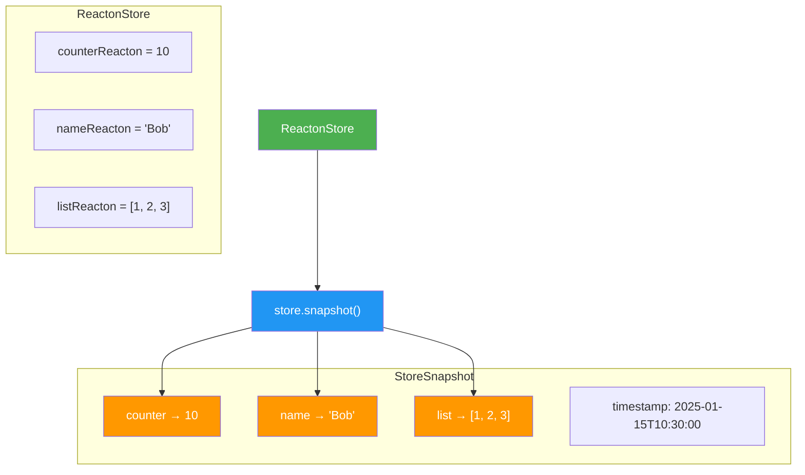

# Snapshots & Diffs

Snapshots are **immutable captures** of all reacton values in a store at a single point in time. They let you freeze state, compare it, and roll back to it. Combined with diffs, snapshots form the foundation for undo systems, time-travel debugging, regression testing, state versioning, and audit trails.

A `StoreSnapshot` does not maintain reactive subscriptions or graph structure -- it is a plain, inert copy of values keyed by `ReactonRef`. This makes snapshots cheap to create, safe to hold indefinitely, and trivial to serialize.

## When to Use

- You need **undo/redo** functionality and want to save checkpoints the user can return to.
- You are building a **time-travel debugger** that lets developers scrub through state history.
- You want to **compare** two points in time to see what changed (added, removed, or modified reactons).
- You need **regression testing** where you assert that a sequence of operations produces an expected final state.
- You want **audit logging** -- capture state before and after a critical operation.

::: tip When NOT to Use
If you only need undo for a single reacton, the built-in [History (Undo/Redo)](/advanced/history) module is more focused. Snapshots capture the **entire store**, which is more powerful but also more expensive for large stores.
:::

## Basic Usage

```dart
import 'package:reacton/reacton.dart';

final counterReacton = reacton(0, name: 'counter');
final nameReacton = reacton('Alice', name: 'name');

final store = ReactonStore();

// Take a snapshot
store.set(counterReacton, 10);
store.set(nameReacton, 'Bob');
final snap1 = store.snapshot();

// Make more changes
store.set(counterReacton, 42);
store.set(nameReacton, 'Charlie');
final snap2 = store.snapshot();

// Compare snapshots
final diff = snap1.diff(snap2);
print(diff.changed); // Shows counter: (10, 42), name: ('Bob', 'Charlie')

// Roll back to the first snapshot
store.restore(snap1);
print(store.get(counterReacton)); // 10
print(store.get(nameReacton));    // 'Bob'
```

## API Reference

### `StoreSnapshot`

An immutable capture of all reacton values at a point in time.

```dart
class StoreSnapshot {
  final Map<ReactonRef, dynamic> values;
  final DateTime timestamp;
}
```

| Property | Type | Description |
|----------|------|-------------|
| `values` | `Map<ReactonRef, dynamic>` | All reacton values keyed by their ref |
| `timestamp` | `DateTime` | When this snapshot was taken |

#### Creating a Snapshot

```dart
final snapshot = store.snapshot();
```

The `snapshot()` method on `ReactonStore` captures the current value of every reacton that has been initialized in the store.

#### Methods

| Method | Signature | Description |
|--------|-----------|-------------|
| `get<T>()` | `T? get<T>(ReactonBase<T> reacton)` | Retrieve the value for a specific reacton. Returns `null` if the reacton was not in the store when the snapshot was taken. |
| `contains()` | `bool contains(ReactonBase reacton)` | Whether this snapshot has a value for the given reacton |
| `size` | `int` | Number of reactons captured in this snapshot |
| `diff()` | `SnapshotDiff diff(StoreSnapshot other)` | Compare this snapshot with another and return the differences |
| `copy()` | `StoreSnapshot copy()` | Create a deep copy of this snapshot (same values and timestamp) |

```dart
final snap = store.snapshot();

// Query individual values
final count = snap.get<int>(counterReacton);     // 10
final hasName = snap.contains(nameReacton);       // true
print('Reactons captured: ${snap.size}');          // 2
print('Taken at: ${snap.timestamp}');

// Copy for safe storage
final archived = snap.copy();
```

#### Restoring a Snapshot

```dart
store.restore(snapshot);
```

The `restore()` method on `ReactonStore` replaces the current value of every reacton found in the snapshot. This triggers normal reactive graph propagation -- computed values recompute, effects re-run, and widgets rebuild.

### `SnapshotDiff`

The result of comparing two snapshots. Contains three maps describing what changed.

```dart
class SnapshotDiff {
  final Map<ReactonRef, dynamic> added;
  final Map<ReactonRef, dynamic> removed;
  final Map<ReactonRef, (dynamic, dynamic)> changed;

  bool get isEmpty;
  bool get isNotEmpty;
}
```

| Property | Type | Description |
|----------|------|-------------|
| `added` | `Map<ReactonRef, dynamic>` | Reactons present in the **other** snapshot but not in **this** one, with their values |
| `removed` | `Map<ReactonRef, dynamic>` | Reactons present in **this** snapshot but not in the **other**, with their values |
| `changed` | `Map<ReactonRef, (dynamic, dynamic)>` | Reactons present in both but with different values. Each entry is a record `(oldValue, newValue)` where `oldValue` is from **this** snapshot and `newValue` is from the **other**. |
| `isEmpty` | `bool` | `true` if there are no differences at all |
| `isNotEmpty` | `bool` | `true` if there is at least one difference |

#### Diff Directionality

The `diff()` method compares **this** snapshot against the **other** snapshot:

```dart
final diff = snapA.diff(snapB);
// added:   in snapB but NOT in snapA
// removed: in snapA but NOT in snapB
// changed: in both, but values differ (snapA value, snapB value)
```

Think of it as: "what would I need to apply to `snapA` to arrive at `snapB`?"

## How It Works



### Snapshot Lifecycle

1. **Capture**: `store.snapshot()` iterates over all registered reacton refs and copies their current values into an unmodifiable map. A `DateTime.now()` timestamp is recorded.

2. **Inspect**: Use `get<T>()`, `contains()`, and `size` to query individual values without affecting the store.

3. **Compare**: `snap1.diff(snap2)` walks both maps and categorizes each ref as added, removed, or changed.

4. **Restore**: `store.restore(snapshot)` writes each value from the snapshot back into the store. The reactive graph propagates as if each value was set manually.

5. **Copy**: `snap.copy()` creates a new `StoreSnapshot` with the same values and timestamp. Useful when you need to archive a snapshot while the original might be garbage-collected.

## Complete Example: Undo System Using Snapshots

```dart
import 'package:reacton/reacton.dart';

// ── State ─────────────────────────────────────────────────────────
final titleReacton = reacton('Untitled', name: 'title');
final contentReacton = reacton('', name: 'content');
final fontSizeReacton = reacton(14.0, name: 'fontSize');

// ── Undo Manager ──────────────────────────────────────────────────
class UndoManager {
  final ReactonStore store;
  final List<StoreSnapshot> _undoStack = [];
  final List<StoreSnapshot> _redoStack = [];
  final int maxHistory;

  UndoManager(this.store, {this.maxHistory = 50});

  /// Save the current state as an undo checkpoint.
  void checkpoint() {
    _undoStack.add(store.snapshot());
    _redoStack.clear(); // new action invalidates redo history

    // Limit memory usage
    if (_undoStack.length > maxHistory) {
      _undoStack.removeAt(0);
    }
  }

  /// Undo the last change by restoring the previous snapshot.
  bool undo() {
    if (_undoStack.isEmpty) return false;

    // Save current state to redo stack
    _redoStack.add(store.snapshot());

    // Restore the previous state
    final previous = _undoStack.removeLast();
    store.restore(previous);
    return true;
  }

  /// Redo the last undone change.
  bool redo() {
    if (_redoStack.isEmpty) return false;

    // Save current state to undo stack
    _undoStack.add(store.snapshot());

    // Restore the redo state
    final next = _redoStack.removeLast();
    store.restore(next);
    return true;
  }

  /// Whether undo is available.
  bool get canUndo => _undoStack.isNotEmpty;

  /// Whether redo is available.
  bool get canRedo => _redoStack.isNotEmpty;

  /// Number of undo steps available.
  int get undoCount => _undoStack.length;

  /// Number of redo steps available.
  int get redoCount => _redoStack.length;

  /// Show what changed between the last checkpoint and current state.
  SnapshotDiff? get pendingChanges {
    if (_undoStack.isEmpty) return null;
    return _undoStack.last.diff(store.snapshot());
  }
}

// ── Usage ─────────────────────────────────────────────────────────
void main() {
  final store = ReactonStore();
  final undo = UndoManager(store);

  // Initial state
  print(store.get(titleReacton));   // 'Untitled'
  print(store.get(contentReacton)); // ''

  // Make changes with checkpoints
  undo.checkpoint();
  store.set(titleReacton, 'My Document');
  store.set(contentReacton, 'Hello, world!');

  undo.checkpoint();
  store.set(fontSizeReacton, 18.0);

  undo.checkpoint();
  store.set(titleReacton, 'My Great Document');
  store.set(contentReacton, 'Hello, world! This is a test.');

  print(store.get(titleReacton)); // 'My Great Document'
  print('Undo steps: ${undo.undoCount}'); // 3

  // Undo last change
  undo.undo();
  print(store.get(titleReacton));   // 'My Document'
  print(store.get(fontSizeReacton)); // 18.0

  // Undo again
  undo.undo();
  print(store.get(fontSizeReacton)); // 14.0

  // Redo
  undo.redo();
  print(store.get(fontSizeReacton)); // 18.0

  // Check what changed since last checkpoint
  final changes = undo.pendingChanges;
  if (changes != null && changes.isNotEmpty) {
    print('Pending changes:');
    for (final entry in changes.changed.entries) {
      print('  ${entry.key.debugName}: ${entry.value.$1} -> ${entry.value.$2}');
    }
  }

  store.dispose();
}
```

## Advanced Patterns

### Snapshot-Based Regression Testing

```dart
import 'package:test/test.dart';
import 'package:reacton/reacton.dart';

void main() {
  test('checkout flow produces expected final state', () {
    final store = ReactonStore();
    final cartReacton = reacton<List<String>>([], name: 'cart');
    final totalReacton = reacton(0.0, name: 'total');

    // Capture initial state
    final before = store.snapshot();

    // Run the operation under test
    store.set(cartReacton, ['Widget A', 'Widget B']);
    store.set(totalReacton, 49.99);

    // Capture final state
    final after = store.snapshot();

    // Assert via diff
    final diff = before.diff(after);
    expect(diff.isNotEmpty, isTrue);
    expect(diff.changed.length, 2);

    // Verify specific values
    expect(after.get(cartReacton), ['Widget A', 'Widget B']);
    expect(after.get(totalReacton), 49.99);

    // Restore and verify rollback
    store.restore(before);
    expect(store.get(cartReacton), isEmpty);
    expect(store.get(totalReacton), 0.0);
  });
}
```

### State Versioning and Audit Trail

```dart
class StateAuditLog {
  final List<_AuditEntry> _entries = [];

  void record(String operation, StoreSnapshot before, StoreSnapshot after) {
    _entries.add(_AuditEntry(
      operation: operation,
      timestamp: DateTime.now(),
      diff: before.diff(after),
      snapshot: after.copy(),
    ));
  }

  /// Find all entries where a specific reacton changed.
  List<_AuditEntry> historyOf(ReactonBase reacton) {
    return _entries
        .where((e) => e.diff.changed.containsKey(reacton.ref))
        .toList();
  }

  /// Roll back to a specific audit entry.
  void rollbackTo(ReactonStore store, int entryIndex) {
    if (entryIndex < 0 || entryIndex >= _entries.length) return;
    store.restore(_entries[entryIndex].snapshot);
  }
}

class _AuditEntry {
  final String operation;
  final DateTime timestamp;
  final SnapshotDiff diff;
  final StoreSnapshot snapshot;

  _AuditEntry({
    required this.operation,
    required this.timestamp,
    required this.diff,
    required this.snapshot,
  });
}
```

### Comparing Snapshots for Debugging

```dart
void printDiff(SnapshotDiff diff) {
  if (diff.isEmpty) {
    print('No changes detected.');
    return;
  }

  if (diff.added.isNotEmpty) {
    print('Added (${diff.added.length}):');
    for (final entry in diff.added.entries) {
      print('  + ${entry.key.debugName ?? entry.key.id}: ${entry.value}');
    }
  }

  if (diff.removed.isNotEmpty) {
    print('Removed (${diff.removed.length}):');
    for (final entry in diff.removed.entries) {
      print('  - ${entry.key.debugName ?? entry.key.id}: ${entry.value}');
    }
  }

  if (diff.changed.isNotEmpty) {
    print('Changed (${diff.changed.length}):');
    for (final entry in diff.changed.entries) {
      final (oldVal, newVal) = entry.value;
      print('  ~ ${entry.key.debugName ?? entry.key.id}: $oldVal -> $newVal');
    }
  }
}
```

## Snapshots in the Store API

For quick reference, here are the snapshot-related methods on `ReactonStore`:

| Method | Signature | Description |
|--------|-----------|-------------|
| `snapshot()` | `StoreSnapshot snapshot()` | Capture an immutable snapshot of all current values |
| `restore()` | `void restore(StoreSnapshot snapshot)` | Restore state from a snapshot, triggering reactive propagation |

Both are also covered in the [Core Concepts](/guide/core-concepts) page under the ReactonStore API section.

## Common Mistakes

::: danger Restoring a Snapshot from a Different Store
A snapshot is keyed by `ReactonRef`. Since refs are created at declaration time and are global, restoring a snapshot into a different store works -- but only for reactons that share the same declaration. If two stores use different reacton declarations, the refs will not match.

```dart
// This works: same reacton declarations used in both stores
final storeA = ReactonStore();
final storeB = ReactonStore();
storeA.set(counterReacton, 42);
final snap = storeA.snapshot();
storeB.restore(snap); // storeB.get(counterReacton) == 42
```
:::

::: warning Snapshots Capture Values, Not Subscriptions
A snapshot is a plain map of values. It does not capture computed reacton formulas, effects, subscriptions, or graph structure. When you restore a snapshot, computed values will automatically recompute based on the restored values, but custom effects must be re-registered independently.
:::

::: warning Memory Usage with Large Histories
Each snapshot holds a copy of every reacton value. For stores with large data (e.g., lists of thousands of items), maintaining a long history of snapshots can consume significant memory. Consider:

- Setting a `maxHistory` limit on your undo stack.
- Only snapshotting specific reactons instead of the whole store.
- Using structural sharing (copy-on-write data structures) for large collections.
:::

::: tip Use `batch()` Before Snapshotting
If you need to make multiple changes that should appear as a single undo step, wrap them in `store.batch()` and take the snapshot before the batch. This way, undoing restores to the state before all the changes.

```dart
final before = store.snapshot();
undoManager.addCheckpoint(before);

store.batch(() {
  store.set(nameReacton, 'New Name');
  store.set(emailReacton, 'new@email.com');
  store.set(roleReacton, 'admin');
});
// A single undo() restores all three values
```
:::

## What's Next

- [History (Undo/Redo)](/advanced/history) -- Per-reacton undo/redo with the built-in history module
- [State Branching](/advanced/branching) -- Create parallel branches of state for speculative changes
- [Core Concepts](/guide/core-concepts) -- `store.snapshot()` and `store.restore()` in the ReactonStore API
- [Collaborative (CRDT)](/advanced/collaborative) -- Distributed state with conflict-free merging
