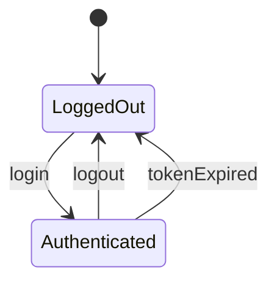
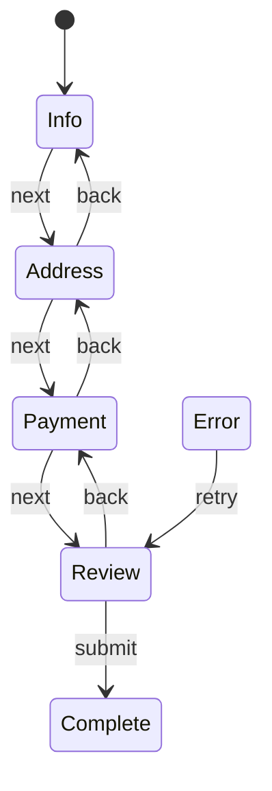

# State Machines

Reacton includes a built-in state machine primitive. Unlike a simple writable reacton where any value can be set at any time, a state machine enforces that state changes only happen through defined transitions. This makes complex workflows predictable, self-documenting, and debuggable.

## Defining a State Machine

Use `stateMachine<S, E>()` to define a state machine with typed states and events:

```dart
enum AuthState { loggedOut, loading, authenticated, error }
enum AuthEvent { login, logout, tokenExpired }

final authMachine = stateMachine<AuthState, AuthEvent>(
  initial: AuthState.loggedOut,
  transitions: {
    AuthState.loggedOut: {
      AuthEvent.login: (ctx) async {
        // Perform async login
        return AuthState.authenticated;
      },
    },
    AuthState.authenticated: {
      AuthEvent.logout: (ctx) => AuthState.loggedOut,
      AuthEvent.tokenExpired: (ctx) => AuthState.loggedOut,
    },
  },
  name: 'auth',
);
```

### Factory Signature

```dart
StateMachineReacton<S, E> stateMachine<S, E>({
  required S initial,
  required Map<S, Map<E, TransitionHandler<S>>> transitions,
  Map<E, TransitionGuard<S>>? guards,
  TransitionEffect<S>? onTransition,
  String? name,
  ReactonOptions<S>? options,
});
```

| Parameter | Type | Description |
|-----------|------|-------------|
| `initial` | `S` | The initial state. |
| `transitions` | `Map<S, Map<E, TransitionHandler<S>>>` | Transition map: for each state, a map of events to handlers. |
| `guards` | `Map<E, TransitionGuard<S>>?` | Optional guard functions that can block transitions. |
| `onTransition` | `TransitionEffect<S>?` | Callback invoked after every successful transition. |
| `name` | `String?` | Optional debug name. |
| `options` | `ReactonOptions<S>?` | Standard reacton options (middleware, persistence, etc.). |

## Transition Map

The transition map is a nested `Map<S, Map<E, TransitionHandler<S>>>`:

- **Outer key** -- the current state
- **Inner key** -- the event
- **Value** -- a handler that returns the next state

```dart
transitions: {
  StateA: {
    EventX: (ctx) => StateB,         // sync transition
    EventY: (ctx) async => StateC,   // async transition
  },
  StateB: {
    EventZ: (ctx) => StateA,
  },
},
```

### TransitionHandler

A transition handler receives a `TransitionContext<S>` and returns the next state, either synchronously or asynchronously:

```dart
typedef TransitionHandler<S> = FutureOr<S> Function(TransitionContext<S> context);
```

### TransitionContext

| Property | Type | Description |
|----------|------|-------------|
| `currentState` | `S` | The current state before the transition. |
| `read` | `ReactonReader?` | Optional reader for accessing other reactons. |

## Sending Events

Use `store.send()` to send an event to a state machine:

```dart
final newState = await store.send(authMachine, AuthEvent.login);
print(newState); // AuthState.authenticated
```

### Signature

```dart
Future<S> send<S, E>(StateMachineReacton<S, E> machine, E event);
```

`send()` throws `StateError` in three cases:

1. **No transition defined** for the current state + event combination.
2. **Guard blocks** the transition.
3. **Concurrent transition** -- an async transition is already in progress.

```dart
try {
  await store.send(authMachine, AuthEvent.login);
} on StateError catch (e) {
  print('Transition rejected: $e');
}
```

## Reading State

### machineState()

Read the current state of a state machine:

```dart
final state = store.machineState(authMachine);
print(state); // AuthState.loggedOut
```

### canSend()

Check if an event can be handled in the current state:

```dart
if (store.canSend(authMachine, AuthEvent.login)) {
  await store.send(authMachine, AuthEvent.login);
}
```

### Store Extension Summary

| Method | Signature | Description |
|--------|-----------|-------------|
| `send` | `Future<S> send(machine, event)` | Send an event, triggering a transition. Returns the new state. |
| `machineState` | `S machineState(machine)` | Read the current state. |
| `canSend` | `bool canSend(machine, event)` | Check if an event is valid for the current state. |

## Guards

Guards are predicate functions that can block a transition. If a guard returns `false`, the transition is rejected and `send()` throws a `StateError`.

```dart
typedef TransitionGuard<S> = bool Function(S currentState);
```

```dart
final authMachine = stateMachine<AuthState, AuthEvent>(
  initial: AuthState.loggedOut,
  transitions: {
    AuthState.loggedOut: {
      AuthEvent.login: (ctx) async => AuthState.authenticated,
    },
    AuthState.authenticated: {
      AuthEvent.logout: (ctx) => AuthState.loggedOut,
    },
  },
  guards: {
    // Only allow login when the network is available
    AuthEvent.login: (currentState) => networkService.isConnected,
  },
  name: 'auth',
);
```

::: tip
Guards receive the current state. Use them to enforce preconditions that depend on external factors (network status, permissions, feature flags).
:::

## Side Effects (onTransition)

The `onTransition` callback is invoked after every successful transition. Use it for logging, analytics, or triggering side effects.

```dart
typedef TransitionEffect<S> = void Function(S previousState, S newState);
```

```dart
final authMachine = stateMachine<AuthState, AuthEvent>(
  initial: AuthState.loggedOut,
  transitions: { /* ... */ },
  onTransition: (previous, next) {
    analytics.track('auth_state_changed', {
      'from': previous.name,
      'to': next.name,
    });

    if (next == AuthState.loggedOut) {
      // Clear sensitive data
      store.set(userDataReacton, null);
    }
  },
  name: 'auth',
);
```

## StateMachineReacton Properties

| Property | Type | Description |
|----------|------|-------------|
| `initial` | `S` | The initial state value. |
| `transitions` | `Map<S, Map<E, TransitionHandler<S>>>` | The full transition map. |
| `guards` | `Map<E, TransitionGuard<S>>?` | Guard functions. |
| `onTransition` | `TransitionEffect<S>?` | Post-transition callback. |
| `stateReacton` | `WritableReacton<S>` | The underlying writable reacton that holds the state value. |
| `isTransitioning` | `bool` | Whether an async transition is currently in progress. |

### Querying Valid Events

```dart
// Get all events valid for a given state
final events = authMachine.validEvents(AuthState.loggedOut);
print(events); // {AuthEvent.login}

// Check if a specific event is valid
print(authMachine.canHandle(AuthState.loggedOut, AuthEvent.login)); // true
print(authMachine.canHandle(AuthState.loggedOut, AuthEvent.logout)); // false
```

## State Diagram

Here is a Mermaid diagram of the authentication flow example:



## Complete Example: Multi-Step Wizard

```dart
enum WizardState { info, address, payment, review, submitting, complete, error }
enum WizardEvent { next, back, submit, retry }

final wizardMachine = stateMachine<WizardState, WizardEvent>(
  initial: WizardState.info,
  transitions: {
    WizardState.info: {
      WizardEvent.next: (ctx) => WizardState.address,
    },
    WizardState.address: {
      WizardEvent.next: (ctx) => WizardState.payment,
      WizardEvent.back: (ctx) => WizardState.info,
    },
    WizardState.payment: {
      WizardEvent.next: (ctx) => WizardState.review,
      WizardEvent.back: (ctx) => WizardState.address,
    },
    WizardState.review: {
      WizardEvent.submit: (ctx) async {
        await api.submitOrder();
        return WizardState.complete;
      },
      WizardEvent.back: (ctx) => WizardState.payment,
    },
    WizardState.error: {
      WizardEvent.retry: (ctx) => WizardState.review,
    },
  },
  guards: {
    // Only allow submit when all fields are valid
    WizardEvent.submit: (state) => formValidator.isValid(),
  },
  onTransition: (prev, next) {
    analytics.track('wizard_step', {'from': prev.name, 'to': next.name});
  },
  name: 'wizard',
);

// Widget
class WizardPage extends StatelessWidget {
  @override
  Widget build(BuildContext context) {
    final state = store.machineState(wizardMachine);

    return Scaffold(
      body: switch (state) {
        WizardState.info => InfoForm(),
        WizardState.address => AddressForm(),
        WizardState.payment => PaymentForm(),
        WizardState.review => ReviewPage(),
        WizardState.submitting => Center(child: CircularProgressIndicator()),
        WizardState.complete => SuccessPage(),
        WizardState.error => ErrorPage(),
      },
      bottomNavigationBar: Row(
        children: [
          if (store.canSend(wizardMachine, WizardEvent.back))
            TextButton(
              onPressed: () => store.send(wizardMachine, WizardEvent.back),
              child: Text('Back'),
            ),
          Spacer(),
          if (store.canSend(wizardMachine, WizardEvent.next))
            ElevatedButton(
              onPressed: () => store.send(wizardMachine, WizardEvent.next),
              child: Text('Next'),
            ),
          if (store.canSend(wizardMachine, WizardEvent.submit))
            ElevatedButton(
              onPressed: () => store.send(wizardMachine, WizardEvent.submit),
              child: Text('Submit'),
            ),
        ],
      ),
    );
  }
}
```



## What's Next

- [Modules](/advanced/modules) -- Group related reactons with lifecycle management
- [State Branching](/advanced/branching) -- Preview state changes before committing
- [History](/advanced/history) -- Add undo/redo to state machines
