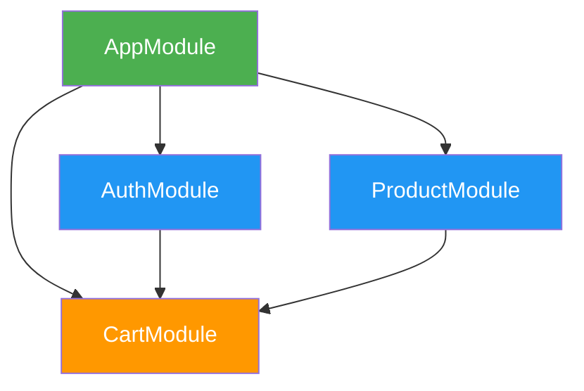

# Common Patterns

This page demonstrates proven architectural patterns for building Reacton applications. Each pattern addresses a specific concern and includes complete code examples you can adapt to your project.

## Repository Pattern

The repository pattern abstracts your data layer behind a clean interface. Reactons consume data from repositories without knowing whether it comes from a REST API, a local database, or a cache.

### Define the Repository Interface

```dart
abstract class UserRepository {
  Future<User> getUser(int id);
  Future<List<User>> getUsers();
  Future<void> updateUser(User user);
  Future<void> deleteUser(int id);
}
```

### Implement the Repository

```dart
class ApiUserRepository implements UserRepository {
  final HttpClient _client;

  ApiUserRepository(this._client);

  @override
  Future<User> getUser(int id) async {
    final response = await _client.get('/users/$id');
    return User.fromJson(response.body);
  }

  @override
  Future<List<User>> getUsers() async {
    final response = await _client.get('/users');
    return (response.body as List).map((j) => User.fromJson(j)).toList();
  }

  @override
  Future<void> updateUser(User user) async {
    await _client.put('/users/${user.id}', body: user.toJson());
  }

  @override
  Future<void> deleteUser(int id) async {
    await _client.delete('/users/$id');
  }
}
```

### Connect to Reactons via a Module

```dart
class UserModule extends ReactonModule {
  @override
  String get name => 'users';

  late final UserRepository _repo;

  late final users = register(asyncReacton<List<User>>(
    (read) => _repo.getUsers(),
    name: 'users.list',
  ));

  late final userById = family<AsyncValue<User>, int>((id) {
    return asyncReacton<User>(
      (read) => _repo.getUser(id),
      name: 'users.byId_$id',
    );
  });

  @override
  void onInit(ReactonStore store) {
    _repo = ApiUserRepository(HttpClient());
    // Trigger initial fetch
    store.get(users);
  }
}
```

### Benefits

- **Testability**: Swap `ApiUserRepository` with a mock in tests.
- **Flexibility**: Switch from REST to GraphQL by changing only the repository implementation.
- **Separation**: The UI layer never imports HTTP libraries.

## Service Layer Integration

When your application has business logic that goes beyond simple CRUD, a service layer sits between repositories and state.

```dart
class CheckoutService {
  final CartRepository _cartRepo;
  final PaymentRepository _paymentRepo;
  final InventoryRepository _inventoryRepo;

  CheckoutService(this._cartRepo, this._paymentRepo, this._inventoryRepo);

  /// Validates inventory, processes payment, and creates order.
  Future<Order> checkout(Cart cart, PaymentMethod payment) async {
    // 1. Verify inventory
    for (final item in cart.items) {
      final available = await _inventoryRepo.checkStock(item.productId);
      if (available < item.quantity) {
        throw InsufficientStockException(item.productId);
      }
    }

    // 2. Process payment
    final transaction = await _paymentRepo.charge(payment, cart.total);

    // 3. Create order
    final order = await _cartRepo.createOrder(cart, transaction.id);
    return order;
  }
}
```

### Connecting Services to State with Effects

```dart
class CheckoutModule extends ReactonModule {
  @override
  String get name => 'checkout';

  late final checkoutStatus = register(
    reacton<CheckoutStatus>(CheckoutStatus.idle, name: 'checkout.status'),
  );

  late final lastOrder = register(
    reacton<Order?>(null, name: 'checkout.lastOrder'),
  );

  late final CheckoutService _service;

  @override
  void onInit(ReactonStore store) {
    _service = CheckoutService(
      ApiCartRepository(),
      StripePaymentRepository(),
      ApiInventoryRepository(),
    );
  }

  /// Call this from UI event handlers
  Future<void> performCheckout(ReactonStore store, Cart cart, PaymentMethod payment) async {
    store.set(checkoutStatus, CheckoutStatus.processing);
    try {
      final order = await _service.checkout(cart, payment);
      store.batch(() {
        store.set(checkoutStatus, CheckoutStatus.success);
        store.set(lastOrder, order);
      });
    } catch (e) {
      store.set(checkoutStatus, CheckoutStatus.error);
    }
  }
}
```

## Dependency Injection via ReactonModule

`ReactonModule` serves as a natural dependency injection container. Instead of a separate DI framework, modules can hold service instances and expose them to the rest of the application.

```dart
class AppModule extends ReactonModule {
  @override
  String get name => 'app';

  late final HttpClient httpClient;
  late final AnalyticsService analytics;
  late final StorageService storage;

  // App-wide reactons
  late final theme = register(reacton(AppTheme.light, name: 'app.theme'));
  late final locale = register(reacton('en', name: 'app.locale'));

  @override
  void onInit(ReactonStore store) {
    httpClient = HttpClient(baseUrl: AppConfig.apiBaseUrl);
    analytics = FirebaseAnalyticsService();
    storage = SharedPrefsStorageService();
  }

  @override
  void onDispose(ReactonStore store) {
    httpClient.close();
  }
}

// Access from other modules:
class ProductModule extends ReactonModule {
  @override
  String get name => 'products';

  @override
  void onInit(ReactonStore store) {
    final app = store.module<AppModule>();
    final repo = ProductRepository(app.httpClient);
    // Use repo for data fetching...
  }
}
```

### Module Dependency Graph

Modules can depend on other modules by accessing them through the store. Keep the dependency direction clear:



::: warning
Avoid circular module dependencies. If `ModuleA` depends on `ModuleB` and vice versa, extract the shared concern into a third module that both depend on.
:::

## Event Bus Pattern with Sagas

For applications with complex asynchronous workflows (multi-step processes, cancellation, retry), the saga pattern acts as an event bus with structured concurrency.

```dart
// Define events
sealed class OrderEvent {}
class PlaceOrder extends OrderEvent {
  final Cart cart;
  final PaymentMethod payment;
  PlaceOrder(this.cart, this.payment);
}
class CancelOrder extends OrderEvent {
  final String orderId;
  CancelOrder(this.orderId);
}
class RefundOrder extends OrderEvent {
  final String orderId;
  RefundOrder(this.orderId);
}

// Define the saga
final orderSaga = saga<OrderEvent>(
  name: 'orderSaga',
  builder: (on) {
    // takeLatest: cancel any in-flight order placement if a new one comes in
    on.onLatest<PlaceOrder>((ctx, event) async {
      ctx.put(orderStatusReacton, OrderStatus.placing);
      try {
        // Step 1: Validate inventory
        final stockOk = await ctx.call(
          () => inventoryService.validateCart(event.cart),
        );
        if (!stockOk) {
          ctx.put(orderStatusReacton, OrderStatus.outOfStock);
          return;
        }

        // Step 2: Process payment
        final txn = await ctx.call(
          () => paymentService.charge(event.payment, event.cart.total),
        );

        // Step 3: Create order
        final order = await ctx.call(
          () => orderService.create(event.cart, txn.id),
        );

        ctx.put(orderStatusReacton, OrderStatus.placed);
        ctx.put(lastOrderReacton, order);
      } on SagaCancelledException {
        ctx.put(orderStatusReacton, OrderStatus.cancelled);
      } catch (e) {
        ctx.put(orderStatusReacton, OrderStatus.error);
      }
    });

    // takeLeading: ignore duplicate cancel requests
    on.onLeading<CancelOrder>((ctx, event) async {
      await ctx.call(() => orderService.cancel(event.orderId));
      ctx.put(orderStatusReacton, OrderStatus.cancelled);
    });
  },
);

// Register and dispatch
final task = store.runSaga(orderSaga);
store.dispatchSaga(orderSaga, PlaceOrder(cart, visa));
```

### When to Use Sagas vs. Simple Effects

| Use Case | Recommendation |
|---|---|
| Log when a value changes | `createEffect` |
| Fetch data when a dependency changes | `asyncReacton` |
| Multi-step workflow with cancellation | `saga` |
| Debounced search | `createEffect` + `Debouncer` or `saga.onLatest` |
| Exactly-once processing (prevent double submit) | `saga.onLeading` |

## Feature Flags with State Branching

State branches enable feature flags and A/B testing at the state level:

```dart
// Create a branch for the new feature
final newCheckoutBranch = store.createBranch('new-checkout-flow');

// Apply feature changes in the branch
newCheckoutBranch.set(checkoutLayoutReacton, CheckoutLayout.singlePage);
newCheckoutBranch.set(paymentOptionsReacton, [PaymentOption.card, PaymentOption.applePay]);

// For users in the experiment group, merge the branch
if (user.isInExperiment('new-checkout')) {
  store.mergeBranch(newCheckoutBranch);
}

// For users not in the experiment, discard it
if (!user.isInExperiment('new-checkout')) {
  newCheckoutBranch.discard();
}
```

### Preview Mode

Branches are also useful for "preview before apply" patterns:

```dart
// User is customizing their profile theme
final previewBranch = store.createBranch('theme-preview');
previewBranch.set(themeReacton, selectedTheme);

// Show preview using branch values
final previewTheme = previewBranch.get(themeReacton);

// User clicks "Apply"
store.mergeBranch(previewBranch);

// User clicks "Cancel"
previewBranch.discard();
```

## CQRS-Like Separation

CQRS (Command Query Responsibility Segregation) separates reads from writes. In Reacton, this maps naturally to the existing primitives:

- **Queries** = `computed` reactons and `selector`s (read-only derived state)
- **Commands** = functions that call `store.set()` or `store.update()` (writes)

```dart
// ---- Queries (computed, read-only) ----

final activeTasksReacton = computed((read) {
  return read(allTasksReacton).where((t) => !t.isCompleted).toList();
}, name: 'tasks.active');

final taskCountReacton = computed((read) {
  return read(activeTasksReacton).length;
}, name: 'tasks.activeCount');

final overdueTasks = computed((read) {
  final now = DateTime.now();
  return read(activeTasksReacton).where((t) => t.dueDate.isBefore(now)).toList();
}, name: 'tasks.overdue');

// ---- Commands (functions that write state) ----

void addTask(ReactonStore store, Task task) {
  store.update(allTasksReacton, (tasks) => [...tasks, task]);
}

void completeTask(ReactonStore store, String taskId) {
  store.update(allTasksReacton, (tasks) {
    return tasks.map((t) => t.id == taskId ? t.copyWith(isCompleted: true) : t).toList();
  });
}

void deleteTask(ReactonStore store, String taskId) {
  store.update(allTasksReacton, (tasks) {
    return tasks.where((t) => t.id != taskId).toList();
  });
}
```

### Benefits of CQRS with Reacton

1. **Queries are automatically cached** -- computed values only recompute when dependencies change.
2. **Commands are explicit** -- every state mutation goes through a named function, making it easy to audit.
3. **Testing is straightforward** -- test queries by checking computed output; test commands by calling the function and checking store state.
4. **DevTools show the flow** -- you can trace which command caused which computed values to recompute.

## Composition Pattern

For complex widgets that need multiple reactons, compose them at the widget level rather than creating a "view model" reacton:

```dart
class DashboardPage extends StatelessWidget {
  @override
  Widget build(BuildContext context) {
    final user = context.watch(userReacton);
    final taskCount = context.watch(taskCountReacton);
    final notifications = context.watch(unreadNotificationsReacton);

    return DashboardLayout(
      userName: user.name,
      taskCount: taskCount,
      notificationCount: notifications.length,
    );
  }
}
```

Each `context.watch()` creates a fine-grained subscription. The widget only rebuilds when one of its specific dependencies changes -- not when unrelated state changes.

## What's Next

- [Performance](/architecture/performance) -- Optimizing selector vs computed, batching, memory management
- [Debugging](/architecture/debugging) -- Tracing patterns through DevTools
- [Scaling to Enterprise](/architecture/scaling) -- Applying these patterns at scale
