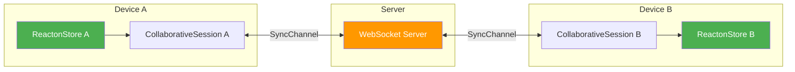
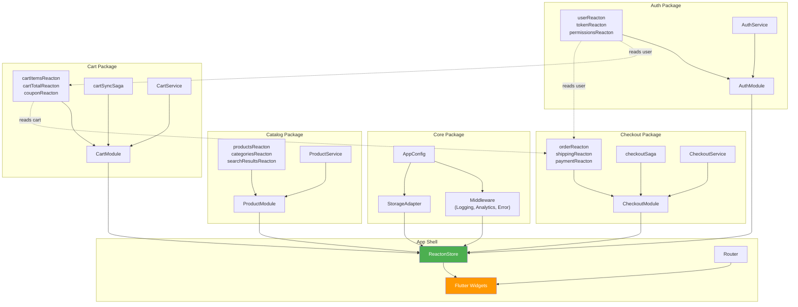

# Scaling to Enterprise

This page covers the patterns, conventions, and infrastructure needed when your Reacton application grows beyond a small team. Whether you have 50 or 500 reactons, multiple contributing teams, or distributed state across devices, these strategies keep your codebase maintainable.

## Module Boundaries for Large Teams

In a large organization, the most important architectural decision is where to draw module boundaries. Each module should correspond to a **bounded context** -- a self-contained domain with clear inputs and outputs.

### Principles

1. **One team, one (or few) modules.** A module should be owned by a single team. If two teams frequently edit the same module, it is too broad and should be split.
2. **Modules communicate through reactons, not direct calls.** One module reads another module's reactons via `computed` or `selector`. It never calls another module's internal methods.
3. **Module interfaces are stable.** The set of reactons a module exposes is its public API. Changing these requires coordination, just like changing an API endpoint.

### Example: E-Commerce Team Structure

```
Team Auth:         AuthModule        (user, token, permissions)
Team Catalog:      ProductModule     (products, categories, search)
Team Cart:         CartModule        (items, coupon, total)
Team Checkout:     CheckoutModule    (order, payment, shipping)
Team Analytics:    AnalyticsModule   (events, funnels)
```

Each module declares its public reactons and keeps implementation details private:

```dart
// packages/domain_cart/lib/domain_cart.dart
// Public API -- only these are exported
export 'src/cart_module.dart' show CartModule;
export 'src/state/cart_public_state.dart'
    show cartItemsReacton, cartTotalReacton, cartItemCountReacton;
// Internal state, services, and effects are NOT exported
```

### Cross-Module Dependencies

When Module B needs data from Module A, it reads Module A's public reactons:

```dart
class CheckoutModule extends ReactonModule {
  @override
  String get name => 'checkout';

  late final orderTotal = register(computed((read) {
    // Reading cart module's public reacton
    final cartTotal = read(cartTotalReacton);
    final shipping = read(shippingCostReacton);
    return cartTotal + shipping;
  }, name: 'checkout.orderTotal'));
}
```

This creates an explicit, trackable dependency in the reactive graph. DevTools shows the cross-module edge, making it easy to understand data flow.

### Module Installation Order

Install modules in dependency order to ensure that dependent reactons can resolve their sources:

```dart
void installModules(ReactonStore store) {
  // Foundation modules first
  store.installModule(AppModule());
  store.installModule(AuthModule());

  // Domain modules that depend on foundation
  store.installModule(ProductModule());
  store.installModule(CartModule());

  // Modules that depend on domain modules
  store.installModule(CheckoutModule());
  store.installModule(AnalyticsModule());
}
```

## State Isolation Patterns

### Scoped Stores

For features that need completely isolated state (multi-tenant dashboards, embedded widgets, or test environments), create separate `ReactonStore` instances:

```dart
// Main app store
final appStore = ReactonStore(
  storageAdapter: mainStorageAdapter,
  globalMiddleware: [loggingMiddleware],
);

// Isolated store for an embedded widget or sub-application
final embeddedStore = ReactonStore();
embeddedStore.installModule(EmbeddedFeatureModule());

// Each store has its own reactive graph, its own values,
// and its own set of modules
```

In Flutter, provide each store via a separate `ReactonScope`:

```dart
// Main app
ReactonScope(
  store: appStore,
  child: MaterialApp(
    home: ReactonScope(
      store: embeddedStore, // Nested scope with isolated store
      child: EmbeddedFeatureWidget(),
    ),
  ),
);
```

Widgets inside `EmbeddedFeatureWidget` will use `embeddedStore` for `context.watch()` and `context.read()`, while widgets outside use `appStore`.

### Per-User State in Multi-Tenant Apps

```dart
class TenantManager {
  final Map<String, ReactonStore> _stores = {};

  ReactonStore getStoreForTenant(String tenantId) {
    return _stores.putIfAbsent(tenantId, () {
      final store = ReactonStore(
        storageAdapter: TenantStorageAdapter(tenantId),
      );
      store.installModule(TenantModule(tenantId));
      return store;
    });
  }

  void disposeTenant(String tenantId) {
    _stores[tenantId]?.dispose();
    _stores.remove(tenantId);
  }
}
```

## Multi-Package Monorepo Strategies

### Package Dependency Rules

In a monorepo with multiple packages, enforce these rules:

```
core         <- No dependencies on other domain packages
domain_auth  <- Depends on: core
domain_cart  <- Depends on: core, domain_auth (for user context)
domain_*     <- Depends on: core, optionally other domain_*
app          <- Depends on: all domain packages
```

**Never allow circular dependencies between domain packages.** If `domain_cart` needs something from `domain_products`, either:
1. Extract the shared concern into `core`
2. Have `domain_cart` depend on `domain_products`
3. Use an event-based pattern (sagas) where neither package imports the other

### Shared Middleware in Core

Common middleware lives in the `core` package and is applied globally:

```dart
// packages/core/lib/src/middleware/error_reporting_middleware.dart
class ErrorReportingMiddleware<T> extends Middleware<T> {
  final ErrorReportingService _service;
  ErrorReportingMiddleware(this._service);

  @override
  void onError(ReactonBase<T> reacton, Object error, StackTrace stackTrace) {
    _service.report(
      error,
      stackTrace,
      context: {'reacton': reacton.ref.debugName},
    );
  }
}
```

### Package-Level Testing

Each domain package has its own test suite that runs independently:

```dart
// packages/domain_cart/test/cart_state_test.dart
import 'package:reacton/reacton.dart';
import 'package:domain_cart/domain_cart.dart';
import 'package:test/test.dart';

void main() {
  late ReactonStore store;

  setUp(() {
    store = ReactonStore();
    store.installModule(CartModule());
  });

  tearDown(() => store.dispose());

  test('adding item increases total', () {
    final cart = store.module<CartModule>();
    store.update(cart.items, (items) => [
      ...items,
      CartItem(name: 'Widget', price: 9.99, qty: 1),
    ]);
    expect(store.get(cart.total), 9.99);
  });
}
```

## CRDT for Distributed State

When your application runs on multiple devices and state must stay synchronized, Reacton's CRDT (Conflict-free Replicated Data Type) module provides strong eventual consistency.

### Architecture Overview



### When to Use CRDT

| Scenario | CRDT? | Alternative |
|---|---|---|
| Collaborative editing (docs, whiteboards) | Yes | -- |
| Offline-first with later sync | Yes | -- |
| Multi-device settings sync | Yes | Server-authoritative also works |
| Real-time multiplayer game state | Depends | Consider server-authoritative |
| Single-device app | No | Not needed |

### Merge Strategies

Choose the right merge strategy for each collaborative reacton:

| Strategy | When to Use | Example |
|---|---|---|
| `LastWriterWins` | Simple values where latest write should win | User profile fields |
| `MaxValue` | Monotonically increasing counters | View counts, visit counters |
| `UnionMerge` | Grow-only sets (elements never removed) | Tags, labels |
| `CustomMerge` | Domain-specific conflict resolution | Document merging |

```dart
// Page view counter: always take the max across devices
final pageViewsReacton = collaborativeReacton(
  0,
  name: 'analytics.pageViews',
  strategy: MaxValue<int>(),
);

// User tags: union across devices (never lose a tag)
final tagsReacton = collaborativeReacton(
  <String>{},
  name: 'user.tags',
  strategy: UnionMerge<Set<String>>(),
);
```

### Conflict Detection and Resolution

When a conflict occurs (concurrent edits from different devices), Reacton resolves it automatically using the configured strategy and emits a `ConflictEvent`:

```dart
session.onConflict.listen((event) {
  analytics.track('state_conflict', {
    'reacton': event.reactonName,
    'localValue': event.localValue.toString(),
    'remoteValue': event.remoteValue.toString(),
    'resolved': event.resolvedValue.toString(),
  });

  // Optionally show a notification to the user
  if (event.reactonName == 'document.title') {
    showSnackBar('Title was updated by another user');
  }
});
```

## Performance at Scale (1000+ Reactons)

At enterprise scale, you may have hundreds or thousands of reactons. Here are strategies to maintain performance.

### Lazy Module Loading

Not all modules need to be installed at startup. Load them lazily when the user navigates to the relevant feature:

```dart
class ModuleLoader {
  final ReactonStore store;
  ModuleLoader(this.store);

  void ensureModule<T extends ReactonModule>(T Function() factory) {
    if (!store.hasModule<T>()) {
      store.installModule(factory());
    }
  }
}

// In a route guard or page initialization:
moduleLoader.ensureModule(() => AnalyticsModule());
```

### Graph Partitioning

Keep your dependency graph shallow. A deep chain (A -> B -> C -> D -> E -> F) means changing A triggers 5 recomputations in sequence. Prefer wider, shallower graphs where computed values read directly from sources.

```dart
// Deep chain (avoid):
final a = reacton(0);
final b = computed((r) => r(a) + 1);
final c = computed((r) => r(b) + 1);
final d = computed((r) => r(c) + 1);
final e = computed((r) => r(d) + 1); // 4 levels deep

// Flat graph (prefer):
final a = reacton(0);
final e = computed((r) => r(a) + 4); // Reads source directly
```

### Monitor Reacton Count

Track your reacton count to detect unbounded growth:

```dart
// In a periodic health check or DevTools dashboard
print('Total reactons: ${store.reactonCount}');
print('Installed modules: ${store.moduleCount}');
```

If reacton count grows over time without bound, you likely have a `family()` cache that is not being cleaned up, or modules that are installed but never uninstalled.

### Subscription Auditing

Periodically audit which reactons have subscribers and which do not:

```dart
for (final ref in store.reactonRefs) {
  final node = store.graph.getNode(ref);
  if (node != null && node.subscriberCount == 0 && !node.isComputed) {
    print('Warning: ${ref.debugName} has no subscribers');
  }
}
```

Reactons with no subscribers are not being watched by any widget or effect. They may be unused state that can be removed.

## Team Conventions and Code Review Guidelines

### Naming Conventions

Enforce these across the team:

| Element | Convention | Example |
|---|---|---|
| Writable reacton | `<noun>Reacton` | `cartItemsReacton` |
| Computed reacton | `<derivedNoun>Reacton` | `cartTotalReacton` |
| Module | `<Domain>Module` | `CartModule` |
| Saga | `<domain>Saga` | `checkoutSaga` |
| Effect (variable) | `<verb><noun>Effect` | `logAnalyticsEffect` |
| Debug name | `<module>.<noun>` | `'cart.items'` |

### Code Review Checklist

When reviewing Reacton code, check for:

- [ ] **Every reacton has a `name` parameter.** Unnamed reactons are invisible in DevTools.
- [ ] **No reactons created inside `build()`.** This is the most common beginner mistake.
- [ ] **`context.watch()` used in `build()`, `context.read()` used in callbacks.** Mixing these up causes either missing rebuilds or excessive rebuilds.
- [ ] **Multi-field updates are batched.** Look for sequential `store.set()` calls that should be in a `store.batch()`.
- [ ] **Custom data classes implement `==` and `hashCode`.** Without correct equality, the graph cannot detect unchanged values.
- [ ] **Family caches are cleaned up.** Look for `family.remove()` or `family.clear()` calls in dispose logic.
- [ ] **Modules have `onDispose` implementations.** Effects and subscriptions created in `onInit` must be cleaned up.
- [ ] **Cross-module dependencies go in one direction.** No circular module imports.
- [ ] **Sensitive data is not persisted unencrypted.** Check `persistKey` usage for tokens, passwords, or PII.

### Architecture Decision Template

Document significant decisions using this template:

```
## ADR-{number}: {Title}

**Status:** Accepted / Proposed / Deprecated
**Date:** YYYY-MM-DD
**Team:** {Team Name}

### Context
What is the problem or situation?

### Decision
What did we decide and why?

### Consequences
What are the trade-offs? What changes?

### Reacton-Specific Notes
Which modules/reactons/patterns are affected?
```

## Real-World Architecture Diagram

Here is a comprehensive architecture diagram for a large e-commerce application:



The dotted lines represent cross-module data dependencies through the reactive graph. These are the edges that connect different team boundaries and should be treated as stable APIs.

## Summary

Scaling Reacton to enterprise applications requires discipline in three areas:

1. **Organization** -- Clear module boundaries, consistent naming, documented decisions
2. **Performance** -- Lazy loading, shallow graphs, subscription auditing, family cleanup
3. **Distribution** -- CRDT for cross-device sync, scoped stores for isolation, multi-package architecture

Start simple, add structure as you grow, and let the reactive graph handle the complexity of state propagation.

## What's Next

- [Project Structure](/architecture/project-structure) -- Detailed directory layouts
- [Common Patterns](/architecture/patterns) -- Repository, service layer, DI, CQRS
- [Testing](/testing/) -- Testing strategies for enterprise applications
