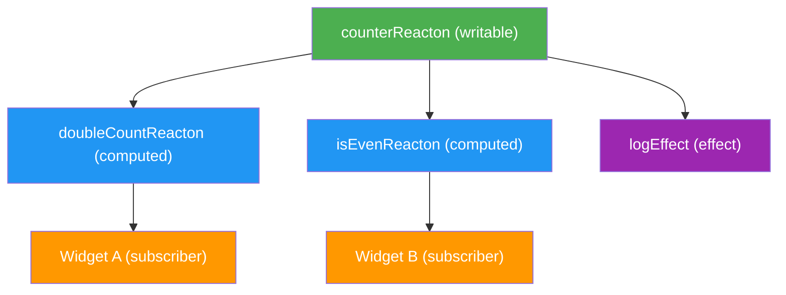

# Core Concepts

This page covers the fundamental building blocks of Reacton: the reactive graph, writable and read-only reactons, selectors, families, effects, and the store.

## The Reactive Graph

Every reacton, computed value, and effect is a node in a **directed acyclic graph (DAG)**. Edges represent dependencies -- "this node reads that node."



Each node has one of three states:

| State | Meaning |
|-------|---------|
| `Clean` | Value is current and valid |
| `Check` | A dependency might have changed; needs verification |
| `Dirty` | Value is known to be stale; must recompute |

When a writable reacton is set, the engine runs the two-phase mark/propagate algorithm:

1. **Mark** -- The source is marked `Dirty`. All descendants are walked and marked `Check`.
2. **Propagate** -- Nodes are processed in topological order (by depth level). `Check` nodes verify whether any source actually changed. If so, they recompute. If not, they are marked `Clean` without recomputation.

This guarantees **glitch-free** updates: no computed value or widget ever observes an inconsistent intermediate state.

## `reacton<T>()` -- Writable State

The `reacton()` function creates a `WritableReacton<T>` -- the primary building block for mutable state.

```dart
final counterReacton = reacton(0, name: 'counter');
final nameReacton = reacton('World', name: 'name');
```

### Signature

```dart
WritableReacton<T> reacton<T>(
  T initialValue, {
  String? name,
  ReactonOptions<T>? options,
  void Function(void Function<V>(WritableReacton<V>, V) set, T value)? onWrite,
})
```

| Parameter | Type | Description |
|-----------|------|-------------|
| `initialValue` | `T` | The starting value before any writes |
| `name` | `String?` | Debug name for DevTools and logging |
| `options` | `ReactonOptions<T>?` | Configuration for equality, middleware, persistence, etc. |
| `onWrite` | `Function?` | Custom write handler that intercepts sets |

### Custom Write Handler

The `onWrite` callback lets you intercept writes and redirect them to other reactons:

```dart
final celsiusReacton = reacton(0.0, name: 'celsius');

final fahrenheitReacton = reacton(
  32.0,
  name: 'fahrenheit',
  onWrite: (set, value) {
    // When fahrenheit is set, also update celsius
    set(celsiusReacton, (value - 32) * 5 / 9);
  },
);
```

### ReactonOptions

`ReactonOptions<T>` configures advanced behavior:

```dart
final counterReacton = reacton(
  0,
  name: 'counter',
  options: ReactonOptions<int>(
    keepAlive: true,          // Keep value even when no watchers remain
    debounce: Duration(ms: 300), // Debounce writes
    persistKey: 'counter',    // Auto-persist to storage
    serializer: intSerializer, // Serializer for persistence
    middleware: [loggingMiddleware], // Per-reacton middleware
    equals: (a, b) => a == b, // Custom equality
  ),
);
```

| Option | Type | Default | Description |
|--------|------|---------|-------------|
| `keepAlive` | `bool` | `false` | Retain value when no watchers exist |
| `debounce` | `Duration?` | `null` | Debounce duration for writes |
| `persistKey` | `String?` | `null` | Storage key for auto-persistence |
| `serializer` | `Serializer<T>?` | `null` | Serialize/deserialize for persistence |
| `middleware` | `List<Middleware<T>>` | `[]` | Middleware chain for this reacton |
| `equals` | `bool Function(T, T)?` | `null` | Custom equality (uses `==` by default) |

## `computed<T>()` -- Derived State

The `computed()` function creates a `ReadonlyReacton<T>` whose value is automatically derived from other reactons.

```dart
final doubleCountReacton = computed(
  (read) => read(counterReacton) * 2,
  name: 'doubleCount',
);

final filteredTodosReacton = computed((read) {
  final todos = read(todosReacton);
  final filter = read(filterReacton);
  return todos.where((t) => t.matches(filter)).toList();
}, name: 'filteredTodos');
```

### Signature

```dart
ReadonlyReacton<T> computed<T>(
  T Function(ReactonReader read) compute, {
  String? name,
  ReactonOptions<T>? options,
})
```

| Parameter | Type | Description |
|-----------|------|-------------|
| `compute` | `T Function(ReactonReader read)` | Function that derives the value. `read` accesses other reactons and tracks dependencies automatically. |
| `name` | `String?` | Debug name |
| `options` | `ReactonOptions<T>?` | Configuration options |

### Automatic Dependency Tracking

The `read` function passed to the compute callback does double duty:

1. **Returns** the current value of the given reacton
2. **Registers** it as a dependency in the reactive graph

Dependencies are re-tracked on every recomputation, so conditional reads work correctly:

```dart
final displayReacton = computed((read) {
  final showDetail = read(showDetailReacton);
  if (showDetail) {
    // Only depends on detailReacton when showDetail is true
    return read(detailReacton);
  }
  return read(summaryReacton);
}, name: 'display');
```

::: tip
Computed reactons are **lazy**. The compute function is not called until something first reads the value.
:::

## `selector<T, S>()` -- Sub-Value Selection

The `selector()` function creates a `SelectorReacton<T, S>` that watches a sub-value of another reacton. Only triggers updates when the selected portion changes.

```dart
final userNameReacton = selector(
  userReacton,
  (user) => user.name,
  name: 'userName',
);
```

### Signature

```dart
SelectorReacton<T, S> selector<T, S>(
  ReactonBase<T> source,
  S Function(T) select, {
  String? name,
  ReactonOptions<S>? options,
})
```

| Parameter | Type | Description |
|-----------|------|-------------|
| `source` | `ReactonBase<T>` | The reacton to select from |
| `select` | `S Function(T)` | Function to extract the sub-value |
| `name` | `String?` | Debug name |
| `options` | `ReactonOptions<S>?` | Configuration options |

### When to Use Selectors

Selectors are most useful when you have a complex state object but widgets only need a small piece of it:

```dart
// Without selector: widget rebuilds on ANY user field change
final user = context.watch(userReacton);
Text(user.name); // Rebuilds even when user.email changes

// With selector: widget rebuilds ONLY when name changes
final name = context.watch(userNameReacton);
Text(name);
```

::: tip
Under the hood, `SelectorReacton` is a subclass of `ReadonlyReacton`. It computes `select(read(source))` and relies on the standard equality check to skip updates when the selected value has not changed.
:::

## `family<T, Arg>()` -- Parameterized Reactons

The `family()` function creates a `ReactonFamily<T, Arg>` -- a factory that produces a distinct reacton instance for each unique argument.

```dart
final userReacton = family<AsyncValue<User>, int>((userId) {
  return asyncReacton(
    (read) => api.getUser(userId),
    name: 'user_$userId',
  );
});

// In a widget:
final user = context.watch(userReacton(42));
```

### Signature

```dart
ReactonFamily<T, Arg> family<T, Arg>(
  ReactonBase<T> Function(Arg arg) create,
)
```

| Parameter | Type | Description |
|-----------|------|-------------|
| `create` | `ReactonBase<T> Function(Arg)` | Factory function called once per unique argument |

### ReactonFamily API

| Method / Property | Return Type | Description |
|-------------------|-------------|-------------|
| `call(arg)` | `ReactonBase<T>` | Get or create the reacton for the argument |
| `contains(arg)` | `bool` | Check if a reacton exists for the argument |
| `remove(arg)` | `void` | Remove the cached reacton |
| `clear()` | `void` | Remove all cached reactons |
| `keys` | `Iterable<Arg>` | All currently cached arguments |
| `reactons` | `Iterable<ReactonBase<T>>` | All currently cached reacton instances |

Results are cached: calling `family(42)` twice returns the same reacton instance.

## `createEffect()` -- Side Effects

The `createEffect()` function creates an `EffectNode` that runs side effects when its dependencies change.

```dart
final dispose = store.registerEffect(
  createEffect((read) {
    final count = read(counterReacton);
    print('Counter changed to: $count');

    // Optionally return a cleanup function
    return () => print('Cleaning up');
  }, name: 'logCounter'),
);

// Later: dispose the effect
dispose();
```

### Signature

```dart
EffectNode createEffect(
  EffectCleanup? Function(ReactonReader read) fn, {
  String? name,
})
```

| Parameter | Type | Description |
|-----------|------|-------------|
| `fn` | `EffectCleanup? Function(ReactonReader read)` | The effect function. Receives a `read` function for dependency tracking. May return a cleanup function. |
| `name` | `String?` | Debug name |

### Effect Lifecycle

1. The effect runs immediately when registered via `store.registerEffect()`
2. Dependencies are automatically tracked through the `read` function
3. When any dependency changes, the previous cleanup function (if any) is called, then the effect re-runs
4. When disposed, the final cleanup function is called and the effect is unregistered from the graph

::: warning
Effects must be registered with a `ReactonStore` via `store.registerEffect()` to be active. The `createEffect()` function only creates the node -- it does not activate it.
:::

## ReactonStore

`ReactonStore` is the central value container for all reactons. It holds values, manages subscriptions, and bridges your code with the reactive graph engine.

```dart
final store = ReactonStore();

// Read
final count = store.get(counterReacton);

// Write
store.set(counterReacton, 42);

// Functional update
store.update(counterReacton, (c) => c + 1);

// Subscribe
final unsubscribe = store.subscribe(counterReacton, (value) {
  print('Counter is now: $value');
});

// Batch multiple mutations
store.batch(() {
  store.set(firstNameReacton, 'John');
  store.set(lastNameReacton, 'Doe');
  // Computed values recompute only once after the batch
});

// Snapshot and restore
final snap = store.snapshot();
// ... make changes ...
store.restore(snap); // Roll back to the snapshot

// Dispose
store.dispose();
```

### Constructor

```dart
ReactonStore({
  StorageAdapter? storageAdapter,
  List<Middleware>? globalMiddleware,
})
```

| Parameter | Type | Description |
|-----------|------|-------------|
| `storageAdapter` | `StorageAdapter?` | Adapter for reacton persistence |
| `globalMiddleware` | `List<Middleware>?` | Middleware applied to all reactons |

### API Reference

| Method | Signature | Description |
|--------|-----------|-------------|
| `get` | `T get<T>(ReactonBase<T> reacton)` | Read the current value (lazy-initializes if needed) |
| `set` | `void set<T>(WritableReacton<T> reacton, T value)` | Set a writable reacton's value |
| `update` | `void update<T>(WritableReacton<T> r, T Function(T) updater)` | Functional update |
| `subscribe` | `Unsubscribe subscribe<T>(ReactonBase<T> r, void Function(T) listener)` | Subscribe to changes; returns an unsubscribe function |
| `registerEffect` | `Unsubscribe registerEffect(EffectNode effect)` | Register and activate an effect |
| `batch` | `void batch(void Function() fn)` | Execute mutations atomically |
| `snapshot` | `StoreSnapshot snapshot()` | Take an immutable snapshot of all values |
| `restore` | `void restore(StoreSnapshot snapshot)` | Restore state from a snapshot |
| `forceSet` | `void forceSet<T>(ReactonBase<T> r, T value)` | Set value without middleware (for testing) |
| `remove` | `void remove(ReactonRef ref)` | Remove a reacton from the store |
| `dispose` | `void dispose()` | Clean up all effects, listeners, and values |

| Property | Type | Description |
|----------|------|-------------|
| `graph` | `ReactiveGraph` | The underlying reactive graph (for DevTools/testing) |
| `storageAdapter` | `StorageAdapter?` | The configured storage adapter |
| `reactonRefs` | `Iterable<ReactonRef>` | All registered reacton refs |
| `reactonCount` | `int` | Number of reactons in the store |

## ReactonRef and Identity

Every reacton has a unique `ReactonRef` that serves as its identity within the store. Refs are created automatically when you call `reacton()`, `computed()`, etc.

```dart
class ReactonRef {
  final int id;            // Unique numeric identifier (auto-incremented)
  final String? debugName; // Optional name for DevTools
}
```

Two reacton declarations always produce distinct refs, even with identical initial values:

```dart
final a = reacton(0, name: 'a');
final b = reacton(0, name: 'b');
assert(a.ref != b.ref); // Different identities
```

This is why reactons should be declared as top-level variables or static fields -- creating a new reacton inside `build()` would produce a new identity on every frame.

::: danger
Never create reactons inside a `build()` method. Each call to `reacton()` creates a new identity, so the store would treat it as a brand-new reacton on every rebuild.
:::

## Equality and When Updates Propagate

By default, Reacton uses Dart's `==` operator to compare values. A `set()` call that produces a value equal to the current value is a no-op -- no graph propagation occurs, no listeners fire, and no widgets rebuild.

```dart
store.set(counterReacton, 0); // Initialize to 0
store.set(counterReacton, 0); // No-op: value unchanged
```

### Custom Equality

Use `ReactonOptions.equals` to provide a custom comparison:

```dart
final listReacton = reacton<List<int>>(
  [],
  name: 'list',
  options: ReactonOptions<List<int>>(
    equals: (a, b) => const ListEquality().equals(a, b),
  ),
);
```

For computed reactons, the same equality check applies. If a computed value recomputes to an equal result, no downstream propagation occurs. This is the mechanism that prevents unnecessary widget rebuilds.

## What's Next

- [Flutter Integration](/flutter/) -- Using reactons in Flutter widgets
- [Context Extensions](/flutter/context-extensions) -- `context.watch()`, `context.read()`, `context.set()`, `context.update()`
- [Widgets](/flutter/widgets) -- `ReactonBuilder`, `ReactonConsumer`, `ReactonListener`, `ReactonSelector`
