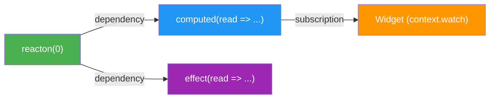

# What is Reacton?

Reacton is a fine-grained reactive state management library for Flutter, built on a directed acyclic graph (DAG) engine that ensures glitch-free, efficient updates with minimal boilerplate.

## Why Reacton?

Most state management solutions in Flutter either require significant boilerplate (Bloc, Redux) or sacrifice fine-grained reactivity for simplicity (Provider). Reacton gives you both: a tiny API surface for simple apps and a full suite of advanced features when you need them.

```dart
// This is all you need to get started
final counter = reacton(0, name: 'counter');
final doubled = computed((read) => read(counter) * 2, name: 'doubled');
```

## The Reactive Graph Engine

At the heart of Reacton is a **reactive graph engine** -- a directed acyclic graph (DAG) that tracks dependencies between reactons, computed values, effects, and widget subscriptions.

When a reacton's value changes, the engine uses a **two-phase mark/propagate algorithm** to efficiently update only what needs updating:

**Phase 1 -- Mark:** When a writable reacton is set, it is marked `Dirty`. All its descendants in the graph are walked and marked as `Check`.

**Phase 2 -- Propagate:** Nodes are processed in topological order (by depth level). For `Check` nodes, the engine verifies whether any source actually changed. If so, it recomputes the node. If not, the node is marked `Clean` without any recomputation.



This approach solves the **diamond dependency problem** -- when a computed value depends on two reactons that both change in the same batch, it recomputes exactly once with both new values, never with an inconsistent intermediate state.

## Progressive API

Reacton is designed with a progressive API so you only learn what you need:

### Level 1 -- The Basics

Covers 80% of apps. Just three concepts:

| API | Purpose |
|-----|---------|
| `reacton(initialValue)` | Create writable state |
| `context.watch(myReacton)` | Read state and rebuild on change |
| `context.set(myReacton, value)` | Write state |

### Level 2 -- Derived State & Effects

For apps that need computed values and side effects:

| API | Purpose |
|-----|---------|
| `computed((read) => ...)` | Derive state from other reactons |
| `createEffect((read) => ...)` | Run side effects when dependencies change |
| `selector(source, (v) => v.field)` | Watch a sub-value of a reacton |
| `context.update(myReacton, (v) => ...)` | Functional update |

### Level 3 -- Enterprise Features

For complex, large-scale applications:

| API | Purpose |
|-----|---------|
| State machines | Finite state transitions with guards |
| State branching | Git-like branches for speculative UI |
| Persistence | Auto-save and restore reacton values |
| Middleware | Intercept reads and writes |
| Multi-isolate | Sync state across Dart isolates |
| History | Undo/redo with full action log |
| Observable collections | Reactive lists and maps |

## Packages Overview

Reacton is organized as a mono-repo of focused packages:

| Package | Description |
|---------|-------------|
| **`reacton`** | Core reactive graph engine, reacton primitives, store, effects, async, middleware, persistence, branching, history, and isolate support. Pure Dart -- no Flutter dependency. |
| **`flutter_reacton`** | Flutter bindings: `ReactonScope`, `context.watch()`, `ReactonBuilder`, `ReactonConsumer`, `ReactonListener`, `ReactonSelector`, form state, and auto-dispose. Re-exports `reacton`. |
| **`reacton_test`** | Testing utilities: `TestStore`, mock reactons, graph assertions, effect tracking, and pump helpers for widget tests. |
| **`reacton_cli`** | Command-line tool for scaffolding projects, generating reacton boilerplate, analyzing dependency graphs, and running diagnostics. |
| **`reacton_generator`** | Build runner code generation: annotation-driven reacton generation and graph analysis. |
| **`reacton_lint`** | Custom lint rules for common mistakes (e.g., using `context.read()` inside `build()`). |
| **`reacton_devtools`** | Flutter DevTools extension for inspecting the reactive graph, viewing reacton values, and time-travel debugging. |

## Design Principles

1. **Fine-grained by default.** Every reacton is an independent node in the graph. Widgets subscribe to exactly the reactons they use.

2. **Glitch-free.** The two-phase algorithm guarantees that no widget or computed value ever sees an inconsistent intermediate state.

3. **Lazy initialization.** Reactons are not evaluated until their value is first read. No work is done until it is needed.

4. **No code generation required.** The core API is fully usable without any build_runner steps. Code generation is available but optional.

5. **Testable.** The pure-Dart `ReactonStore` can be used and tested without any Flutter dependency.

## What's Next

- [Installation](/guide/installation) -- Add Reacton to your project
- [Quick Start](/guide/quick-start) -- Build a counter app in 5 minutes
- [Core Concepts](/guide/core-concepts) -- Deep dive into reactons, computed, effects, and the store
