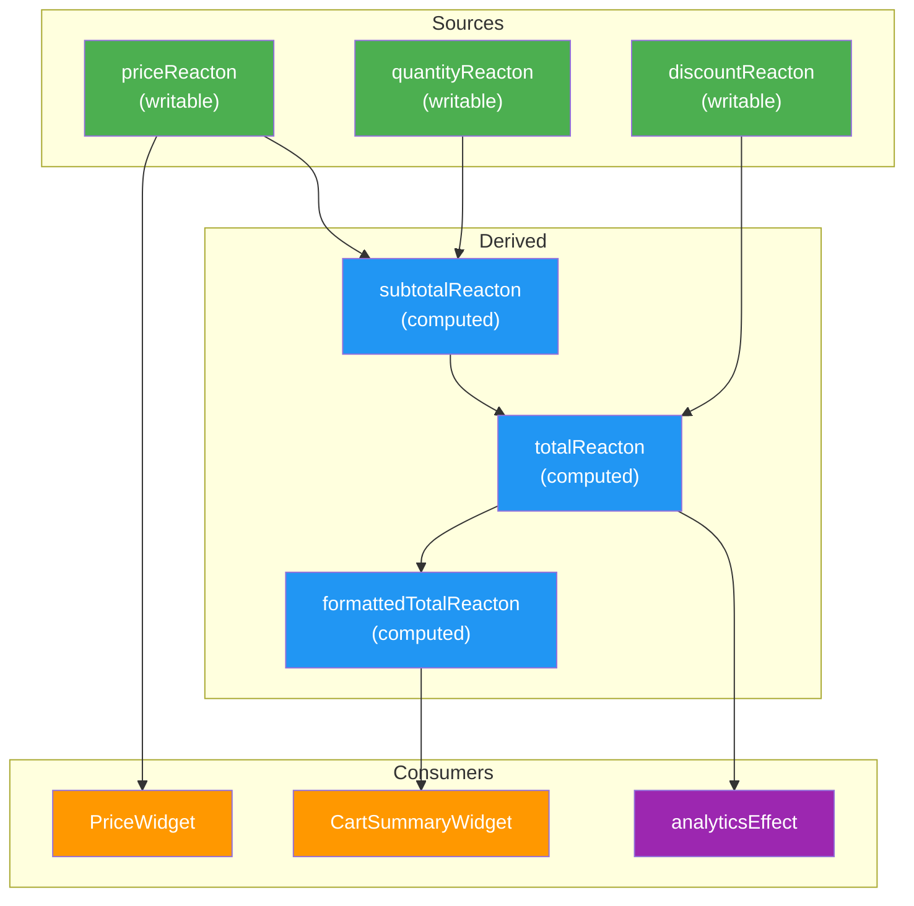

# Thinking in Reacton

Before writing a single line of code, it helps to build a mental model of how Reacton works. This page establishes that model with analogies, diagrams, and decision guides so you can make confident architectural choices from day one.

## The Spreadsheet Analogy

The fastest way to understand Reacton is to think of a spreadsheet.

| Spreadsheet Concept | Reacton Equivalent | Example |
|---|---|---|
| **Cell with a typed value** | `reacton(value)` | `final price = reacton(9.99)` |
| **Formula cell** (`=A1*B1`) | `computed((read) => ...)` | `final total = computed((read) => read(price) * read(qty))` |
| **A cell that shows only part of another** | `selector(source, (v) => v.field)` | `final name = selector(user, (u) => u.name)` |
| **A macro that runs on change** | `createEffect((read) => ...)` | Log to analytics when a value changes |
| **The entire workbook** | `ReactonStore` | The central container that holds every value |

In a spreadsheet, when you change cell **A1**, every formula that references **A1** recalculates automatically. No formula ever shows a stale result, and formulas that do not depend on **A1** are left alone. Reacton works exactly the same way.

The key insight is **declarative derivation**: you never manually tell a computed value to update. You declare _how_ it derives its value, and the engine handles the rest.

## State as a Directed Acyclic Graph

Under the hood, every reacton, computed value, selector, and effect is a **node** in a directed acyclic graph (DAG). Edges represent "reads from" relationships.



**Legend:**
- Green nodes are **writable reactons** -- your sources of truth
- Blue nodes are **computed reactons** -- derived automatically
- Orange nodes are **widget subscribers** -- Flutter UI that rebuilds
- Purple nodes are **effects** -- side effects like logging or API calls

### How Updates Flow

When you call `store.set(priceReacton, 19.99)`:

1. **Mark phase** -- `priceReacton` is marked `Dirty`. Its descendants (`subtotalReacton`, `totalReacton`, `formattedTotalReacton`, widgets, and effects) are marked `Check`.
2. **Propagate phase** -- Nodes are visited in topological order (by depth). Each `Check` node verifies whether its sources actually changed. If so, it recomputes. If not, it is marked `Clean` without work.
3. **Notify phase** -- Only widgets whose values actually changed receive rebuild notifications.

This two-phase algorithm guarantees **glitch-free propagation**: no widget or computed value ever observes an inconsistent intermediate state.

## When to Use a Reacton vs. Local Widget State

Not everything needs to be a reacton. Here is a decision guide:

| Question | If Yes... | If No... |
|---|---|---|
| Do multiple widgets need this value? | Use a **reacton** | Consider local state |
| Does this value survive navigation (push/pop)? | Use a **reacton** | `useState` or `StatefulWidget` may suffice |
| Is this value derived from other state? | Use **computed** | -- |
| Is this value purely UI-local (animation, focus, scroll offset)? | Use local widget state | -- |
| Does this value need to persist across app restarts? | Use a **reacton** with `persistKey` | -- |
| Do you need undo/redo for this value? | Use a **reacton** with `History` | -- |

**Rule of thumb:** If a piece of state belongs to the _application domain_ (user data, settings, feature flags, cart items), it should be a reacton. If it belongs to the _widget presentation_ (whether a dropdown is open, a scroll offset), keep it local.

```dart
// Application state -- use a reacton
final cartItemsReacton = reacton<List<CartItem>>([], name: 'cartItems');

// UI-local state -- keep in the widget
class _DropdownState extends State<Dropdown> {
  bool _isOpen = false; // No other widget cares about this
}
```

## Where to Declare Reactons

Reactons should be declared once and reused everywhere. There are two main patterns:

### Top-Level Variables (Simple Apps)

For small to medium apps, declare reactons as top-level variables in dedicated files:

```dart
// lib/state/counter_state.dart
import 'package:reacton/reacton.dart';

final counterReacton = reacton(0, name: 'counter');
final doubleCountReacton = computed(
  (read) => read(counterReacton) * 2,
  name: 'doubleCount',
);
```

This works because `reacton()` creates an identity (a `ReactonRef`) -- not a value. The value lives in the `ReactonStore`. Multiple calls to `reacton()` create multiple identities, which is why you must never call `reacton()` inside `build()`.

### Modules (Large Apps)

For larger apps with team boundaries, group related reactons into modules:

```dart
class CartModule extends ReactonModule {
  @override
  String get name => 'cart';

  late final items = register(reacton<List<CartItem>>([], name: 'cart.items'));
  late final total = register(computed(
    (read) => read(items).fold(0.0, (sum, item) => sum + item.price),
    name: 'cart.total',
  ));

  @override
  void onInit(ReactonStore store) {
    // Load persisted cart, set up effects, etc.
  }
}
```

Modules provide namespace isolation, lifecycle hooks, and clean uninstallation. See the [Modules guide](/advanced/modules) for details.

::: danger
Never create reactons inside a `build()` method. Each call to `reacton()` creates a new identity, so the store would treat it as a brand-new reacton on every rebuild -- leaking memory and breaking reactivity.
:::

## The Reactive Contract

Reacton makes several guarantees that you can rely on when reasoning about your code:

### 1. Fine-Grained Subscriptions

When a widget calls `context.watch(counterReacton)`, it subscribes to _that specific reacton_ -- not to the entire store. If `nameReacton` changes but `counterReacton` does not, the widget does not rebuild. This is fundamentally different from `setState()` or `ChangeNotifier.notifyListeners()` which trigger broad rebuilds.

### 2. Glitch-Free Propagation

Computed values never observe inconsistent intermediate states. Consider:

```dart
final first = reacton('John', name: 'first');
final last = reacton('Doe', name: 'last');
final full = computed((read) => '${read(first)} ${read(last)}', name: 'full');
```

If you batch-update both names:

```dart
store.batch(() {
  store.set(first, 'Jane');
  store.set(last, 'Smith');
});
```

The `full` computed reacton will recompute exactly once and produce `'Jane Smith'`. It will never produce `'Jane Doe'` or `'John Smith'` as intermediate values. This is the glitch-free guarantee.

### 3. Equality Gating

A `set()` call that produces a value equal (by `==` or custom equality) to the current value is a no-op. No propagation occurs, no listeners fire, no widgets rebuild. This prevents cascading updates when values do not actually change.

### 4. Lazy Evaluation

Computed reactons do not compute until something first reads them. If no widget or effect ever reads a computed value, its compute function never runs. This means you can declare many computed reactons without paying a runtime cost for unused ones.

## Common Anti-Patterns

Avoid these mistakes when getting started with Reacton:

### Too Many Reactons

```dart
// Bad: every single field is its own reacton
final userNameReacton = reacton('');
final userEmailReacton = reacton('');
final userAgeReacton = reacton(0);
final userAvatarReacton = reacton('');
// ...20 more fields
```

If these fields always change together (e.g., when fetching a user), use a single reacton with a data class:

```dart
// Good: one reacton for the cohesive unit
final userReacton = reacton(User.empty(), name: 'user');

// Use selectors for fine-grained widget subscriptions
final userNameReacton = selector(userReacton, (u) => u.name, name: 'userName');
```

### Too Few Reactons

```dart
// Bad: the entire app state in one giant object
final appStateReacton = reacton(AppState(...), name: 'appState');
```

This defeats fine-grained reactivity. Every widget watching `appStateReacton` rebuilds whenever _any_ field changes. Break your state into domain-aligned units.

### Reading Without Watching

```dart
// Bad: uses read() in build -- widget will never rebuild on changes
@override
Widget build(BuildContext context) {
  final count = context.read(counterReacton); // One-time read!
  return Text('$count');
}
```

Use `context.watch()` in `build()` methods so the widget subscribes to changes:

```dart
// Good: uses watch() -- widget rebuilds when counter changes
@override
Widget build(BuildContext context) {
  final count = context.watch(counterReacton);
  return Text('$count');
}
```

Reserve `context.read()` for event handlers and callbacks where you need a one-time, point-in-time value.

### Creating Reactons Conditionally

```dart
// Bad: a new reacton identity is created on some rebuilds but not others
Widget build(BuildContext context) {
  if (showAdvanced) {
    final advanced = reacton(0); // New identity each time!
    context.watch(advanced);
  }
  // ...
}
```

Always declare reactons outside of `build()`. If you need conditional behavior, use computed reactons with conditional reads:

```dart
// Good: conditional dependency tracking in computed
final displayReacton = computed((read) {
  if (read(showAdvancedReacton)) {
    return read(advancedValueReacton);
  }
  return read(simpleValueReacton);
});
```

## Progressive API Levels

Reacton is designed so you can start simple and adopt advanced features only when needed:

### Level 1: Simple (Getting Started)

| Concept | API |
|---|---|
| Writable state | `reacton(value)` |
| Derived state | `computed((read) => ...)` |
| Side effects | `createEffect((read) => ...)` |
| Widget binding | `context.watch()`, `context.read()` |
| Store basics | `store.get()`, `store.set()`, `store.batch()` |

This covers 80% of use cases. Start here and stay here until you genuinely need more.

### Level 2: Patterns (Growing Apps)

| Concept | API |
|---|---|
| Sub-value selection | `selector(source, (v) => v.field)` |
| Parameterized state | `family<T, Arg>((arg) => ...)` |
| Async data | `asyncReacton`, `QueryReacton` |
| Persistence | `ReactonOptions(persistKey: ...)` |
| Modules | `ReactonModule` |
| History | `store.enableHistory(reacton)` |

### Level 3: Enterprise (Large Teams & Complex Domains)

| Concept | API |
|---|---|
| State branching | `store.createBranch('experiment')` |
| CRDT sync | `collaborativeReacton()` |
| Sagas | `saga<Event>(builder: ...)` |
| Lenses | `lens(source, get, set)` |
| State machines | `StateMachineReacton` |
| Observable collections | `reactonList`, `reactonMap` |
| Interceptors | `Interceptor(onWrite: ...)` |

You do not need to learn everything at once. The graph engine underneath is the same at every level -- these are just higher-level patterns built on top of the same primitives.

## What's Next

- [Core Concepts](/guide/core-concepts) -- Deep dive into each primitive
- [Glossary](/guide/glossary) -- Quick reference for all Reacton terms
- [Flutter Integration](/flutter/) -- Using reactons in Flutter widgets
- [Architecture Overview](/architecture/) -- Structuring larger applications
